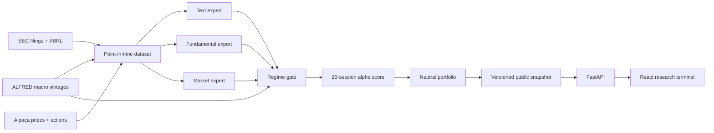

# EDGAR-MoE

Regime-aware multimodal alpha research from SEC filings.

EDGAR-MoE tests whether the predictive value of filing text, XBRL fundamentals, and market features changes with the market regime. A learned Mixture-of-Experts gate combines the modalities, and a cost-aware neutral portfolio translates scores into an auditable research backtest.

> Research software only. It does not provide investment advice, assess suitability, or submit orders.

## What makes this a quant project

- Every feature has an `available_at` timestamp and fails the build if it exceeds the filing cutoff.
- Development, validation, and locked-test periods are chronological and separated by an embargo.
- The portfolio constrains gross, net, beta, industry, and individual-name exposure.
- Results include baselines, ablations, transaction costs, borrow costs, confidence intervals, and failed hypotheses.
- The bundled demo is explicitly synthetic. Real conclusions are produced only by the authenticated point-in-time pipeline.

## Architecture



## Quick start

Requirements: Python 3.12, Node.js 24 LTS, `uv`, and npm.

```bash
cp .env.example .env
uv sync --extra research --extra dev
npm --prefix apps/web install
uv run edgar-moe demo --epochs 12
```

Start the API and web app in separate terminals:

```bash
uv run edgar-moe serve
npm --prefix apps/web run dev
```

Open `http://localhost:5173`. API documentation is at `http://localhost:8000/api/docs`.

The demo trains the real PyTorch MoE against a deterministic synthetic dataset with genuine regime-dependent modality effects. It verifies the complete model → backtest → export → API → UI path without suggesting that synthetic performance is market evidence.

## Deployment

The public demo deploys as one Vercel project: Vite emits the React static application, and `api/index.py` exposes the snapshot-backed FastAPI application as one Python Function in Singapore (`sin1`). The function installs only the serving dependencies; the `research` extra remains available for local training and the scheduled GitHub workflow.

```bash
npx vercel@latest
npx vercel@latest --prod
```

The bundled snapshot requires no database, secrets, or paid data service. Vercel's generated `vercel.app` domain is sufficient; a custom domain is optional.

## Authenticated data setup

Create free Alpaca and FRED API keys and set the values in `.env`. Set `SEC_USER_AGENT` to a descriptive application name and contact email.

```bash
uv run edgar-moe ingest-assets
uv run edgar-moe ingest-sec --cik 0000320193
uv run edgar-moe refresh-data \
  --universe config/universe.example.csv \
  --as-of 2026-07-31
```

`refresh-data` concurrently collects SEC submissions and company facts, adjusted Alpaca/IEX daily bars (including SPY), and FRED observations using the requested historical vintage. It writes a dated manifest containing row counts, configuration, and SHA-256 hashes without storing credentials.

The five-company `config/universe.example.csv` is a connectivity fixture, not a research universe. Replace it with a dated, reviewed universe file before estimating performance; a credible cross-sectional study needs materially broader coverage and point-in-time membership controls.

Raw and processed datasets are ignored by Git. Public snapshots contain derived research output only; they do not redistribute raw market data. The authenticated bundle is an input checkpoint, not a publishable result: mapping review, feature construction, model selection, and a frozen out-of-sample run must finish before replacing the synthetic snapshot.

The weekly GitHub workflow always refreshes the transparent demo. When all four repository secrets are configured, it also retains the authenticated input bundle as a private, seven-day workflow artifact. It never promotes those inputs to public signals automatically.

## Repository map

| Area | Responsibility |
|---|---|
| `src/edgar_moe/data` | SEC, Alpaca, ALFRED clients; authenticated refresh; security mappings; analytical storage; demo pipeline |
| `src/edgar_moe/features` | Filing text, XBRL ratios, market features, and availability audits |
| `src/edgar_moe/modeling` | Fold-only preprocessing, baselines, PyTorch MoE, deterministic training |
| `src/edgar_moe/backtest` | Neutral allocation, event-driven accounting, costs, and inference metrics |
| `src/edgar_moe/api` | Versioned, snapshot-backed FastAPI contract |
| `apps/web` | React/TypeScript research terminal |

## Research contract

- Forms: 10-K and 10-Q; amendments excluded.
- Entry: first NYSE open strictly after SEC acceptance.
- Primary target: 20-session beta-adjusted abnormal return.
- Universe: monthly liquid common-stock universe using only trailing information.
- Splits: development through 2022, validation in 2023–2024, locked test from 2025.
- Base portfolio: 100% gross, ≤2% net, ≤0.05 beta, ≤5% SIC-industry, ≤2% per name.
- Cost scenarios: 10/25/50 bps plus 2%/5% annual borrow sensitivity.

See [architecture](docs/architecture.md), [data card](docs/data-card.md), [model card](docs/model-card.md), and the [research report](reports/research_report.md).

For a concise, accurate project description tailored to a one-page résumé, see the [CV entry](docs/cv-entry.md).

## Quality checks

```bash
uv run pytest
uv run ruff check .
uv run mypy src
npm --prefix apps/web run test
npm --prefix apps/web run build
```

The project is licensed under the MIT License. Source datasets retain their own terms and redistribution restrictions.
