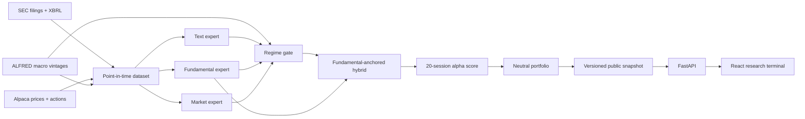

# EDGAR-MoE

Regime-aware multimodal alpha research from SEC filings.

EDGAR-MoE tests whether the predictive value of filing text, XBRL fundamentals, and market features changes with the market regime. A learned Mixture-of-Experts gate combines the modalities, and a cost-aware neutral portfolio translates scores into an auditable research backtest.

> Research software only. It does not provide investment advice, assess suitability, or submit orders.

> **Authenticated-study status (cutoff 2026-07-31):** the source checkpoint,
> frozen-FinBERT dataset, and pre-test walk-forward study are complete. A 75%
> fundamental / 25% MoE hybrid achieved rank IC 0.0617 in 2023 and 0.0648 in
> 2024 across 2,305 out-of-fold events. These are development results: the
> 2025–2026 locked test remains sealed, its prediction count is zero, and no
> authenticated performance snapshot is published. See the
> [walk-forward report](reports/walk_forward_report.md).

## What makes this a quant project

- Every feature has an `available_at` timestamp and fails the build if it exceeds the filing cutoff.
- Development, validation, and locked-test periods are chronological and separated by an embargo.
- The portfolio constrains gross, net, beta, industry, and individual-name exposure.
- Results include baselines, ablations, transaction costs, borrow costs, confidence intervals, and failed hypotheses.
- The bundled demo is explicitly synthetic. Real conclusions are produced only by the authenticated point-in-time pipeline.

## Architecture



## Quick start

Requirements: Python 3.12, Node.js 24 LTS, `uv`, and npm.

```bash
cp .env.example .env
uv sync --extra research --extra dev
npm --prefix apps/web install
uv run edgar-moe demo --epochs 12
```

Start the API and web app in separate terminals:

```bash
uv run edgar-moe serve
npm --prefix apps/web run dev
```

Open `http://localhost:5173`. API documentation is at `http://localhost:8000/api/docs`.

The demo trains the real PyTorch MoE against a deterministic synthetic dataset with genuine regime-dependent modality effects. It verifies the complete model → backtest → export → API → UI path without suggesting that synthetic performance is market evidence.

## Deployment

The public demo deploys as one Vercel project: Vite emits the React static application, and `api/index.py` exposes the snapshot-backed FastAPI application as one Python Function in Singapore (`sin1`). The function installs only the serving dependencies; the `research` extra remains available for local training and the scheduled GitHub workflow.

```bash
npx vercel@latest
npx vercel@latest --prod
```

The bundled snapshot requires no database, secrets, or paid data service. Vercel's generated `vercel.app` domain is sufficient; a custom domain is optional.

## Authenticated research run

Create free Alpaca and FRED API keys and put them in `.env`. Set `SEC_USER_AGENT` to an application name plus your real contact email. Credentials are read only at runtime and never written into a dataset or snapshot.

First build the security master from the current SEC exchange file plus active and inactive Alpaca assets. Review every non-confident mapping in the generated evidence file before treating the universe as research-ready.

```bash
uv run edgar-moe build-universe \
  --output config/universe.csv \
  --review-output data/interim/security-mapping-review.json

uv run edgar-moe screen-universe \
  --source config/universe.csv \
  --output config/universe.research.csv \
  --as-of 2026-07-31 \
  --candidate-count 500
```

Then execute the pipeline in explicit stages:

```bash
# 1. Resumable, hashed source checkpoint
uv run edgar-moe refresh-data \
  --universe config/universe.research.csv \
  --as-of 2026-07-31 \
  --config config/authenticated-free.yaml \
  --resume

# 2. Filing parsing, frozen FinBERT embeddings, point-in-time XBRL/market/macro features
uv run edgar-moe build-dataset \
  --checkpoint data/raw/authenticated/2026-07-31 \
  --embedder finbert \
  --device cpu \
  --config config/authenticated-free.yaml

# 3. Expanding 2023/2024 walk-forward selection; the locked test is never scored
uv run edgar-moe walk-forward-study \
  --dataset-dir data/processed/<dataset-id> \
  --config config/authenticated-free.yaml

# 4. Only after reviewing and recording the selection hash; run exactly once
uv run edgar-moe open-frozen-test \
  --dataset-dir data/processed/<dataset-id> \
  --selection data/artifacts/walk-forward/<dataset-id>/walk-forward-selection.json \
  --confirm-selection-hash <reviewed-selection-sha256> \
  --publish-snapshot data/demo/snapshot.json
```

`screen-universe` removes probable funds/ETPs and ranks operating-company candidates by trailing free IEX dollar volume. The free authenticated configuration uses 500 screened candidates and a prior-month top-300 model universe. This is a deliberate compute/data-budget compromise and its current-membership survivorship limitation remains disclosed.

`refresh-data` downloads complete 10-K/10-Q histories and filing HTML, point-in-time company facts, split-adjusted Alpaca/IEX daily bars and corporate actions, and initial-release FRED/ALFRED observations. It excludes issuers without eligible periodic forms before market collection, stores large SEC payloads and filings as gzip, streams bars to disk, supports resuming an interrupted cutoff, and verifies SHA-256 hashes before returning.

`build-dataset` constructs a prior-month liquid universe, attaches an availability record to every feature, rejects look-ahead violations, caches text embeddings, and censors labels that have not matured. `walk-forward-study` refits preprocessing and models independently in expanding 2023 and 2024 folds, compares 33 standalone and anchored candidates, and freezes the champion by worst-fold rank IC. It writes content-hashed out-of-fold predictions and never transforms, predicts, or evaluates the locked rows.

The earlier single-window diagnostic remains in `reports/validation_report.md`;
the walk-forward report supersedes it for model selection. Test-period scores,
gate weights, expert predictions, and comparison predictions remain absent.
`open-frozen-test` verifies the selection and OOF-prediction hashes before it can
access locked outcomes, refits only the frozen champion, and refuses to overwrite
an existing locked artifact. It has not been run on the authenticated dataset.

The five-company `config/universe.example.csv` and `--embedder hashing` are connectivity fixtures only. They must never be used to claim market performance. A credible run uses the reviewed broad universe and the configured FinBERT encoder.

Raw, processed, and model artifacts are ignored by Git. Public snapshots contain derived research output only; they do not redistribute source market data. No database is required for the deployed site because it reads one immutable, versioned snapshot; local research tables remain Parquet/NPZ files with hash manifests.

The scheduled GitHub job refreshes only the transparent synthetic demo. The authenticated checkpoint job is manual, requires all four repository secrets plus a reviewed `config/universe.csv`, and retains its private bundle for seven days. It never opens the locked test or publishes signals automatically.

## Repository map

| Area | Responsibility |
|---|---|
| `src/edgar_moe/data` | SEC, Alpaca, ALFRED clients; authenticated refresh; security mappings; analytical storage; demo pipeline |
| `src/edgar_moe/features` | Filing text, XBRL ratios, market features, and availability audits |
| `src/edgar_moe/modeling` | Fold-only preprocessing, baselines, shrinkage-gated PyTorch MoE, anchored hybrids, deterministic walk-forward selection |
| `src/edgar_moe/backtest` | Neutral allocation, event-driven accounting, costs, and inference metrics |
| `src/edgar_moe/api` | Versioned, snapshot-backed FastAPI contract |
| `apps/web` | React/TypeScript research terminal |

## Research contract

- Forms: 10-K and 10-Q; amendments excluded.
- Entry: first NYSE open strictly after SEC acceptance.
- Primary target: 20-session beta-adjusted abnormal return.
- Universe: monthly liquid common-stock universe using only trailing information.
- Splits: development through 2022, validation in 2023–2024, locked test from 2025.
- Base portfolio: 100% gross, ≤2% net, ≤0.05 beta, ≤5% SIC-industry, ≤2% per name.
- Cost scenarios: 10/25/50 bps plus 2%/5% annual borrow sensitivity.

See [architecture](docs/architecture.md), [data card](docs/data-card.md), [model card](docs/model-card.md), the [research runbook](docs/research-runbook.md), and the [research report](reports/research_report.md).

For a concise, accurate project description tailored to a one-page résumé, see the [CV entry](docs/cv-entry.md).

## Quality checks

```bash
uv run pytest
uv run ruff check .
uv run mypy src
npm --prefix apps/web run test
npm --prefix apps/web run build
```

The project is licensed under the MIT License. Source datasets retain their own terms and redistribution restrictions.
