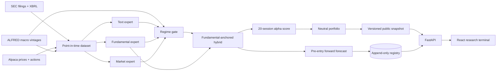

# EDGAR-MoE

Regime-aware multimodal alpha research from SEC filings.

EDGAR-MoE tests whether the predictive value of filing text, XBRL fundamentals, and market features changes with the market regime. A learned Mixture-of-Experts gate combines the modalities, and a cost-aware neutral portfolio translates scores into an auditable research backtest.

> Research software only. It does not provide investment advice, assess suitability, or submit orders.

[Live research terminal](https://edgar-moe.vercel.app) · [API docs](https://edgar-moe.vercel.app/api/docs) · [Frozen locked-test report](reports/authenticated_research_report.md)

> **Authenticated-study status (cutoff 2026-07-31):** complete. The frozen 75%
> fundamental / 25% MoE hybrid achieved rank IC 0.0632 across 2,305 pre-test
> out-of-fold events and 0.0316 across 1,794 locked 2025–2026 events. The pre-test
> figure is development evidence, not an independent estimate: each fold
> early-stopped on itself and the champion was the best of 33 candidates, so part
> of the gap is selection bias. The cost-aware portfolio was not profitable: at
> 10 bps round-trip cost, annualized return was -3.28% and Sharpe was -0.63 (95%
> block-bootstrap interval [-2.31, 0.94]). The weak positive ordering did not
> survive implementation costs. See the [locked report](reports/authenticated_research_report.md).
>
> **Known v1 defects:** the frozen fundamental features mix quarterly with
> year-to-date income and can reuse years-old revenue, and the Elastic Net
> baselines were over-regularized. v1 stays frozen and these limitations are
> disclosed in the [model card](docs/model-card.md#known-v1-limitations); later
> studies use corrected fundamentals ([ADR 0015](docs/adr/0015-xbrl-fact-selection-policy.md))
> and a revised selection protocol ([ADR 0017](docs/adr/0017-post-v1-selection-protocol.md)).

## Start here

| If you want to… | Go to |
| --- | --- |
| See what the study found | The [live site](https://edgar-moe.vercel.app), whose pages lead with a one-sentence answer |
| Understand the system design | [Solution architecture](docs/solution-architecture.md): context, views, security, operations, and a requirement-to-test traceability matrix |
| Review the decisions | The [ADR index](docs/adr/README.md): 24 decisions grouped by theme |
| Check the research is honest | The [research contract](#research-contract), [model card](docs/model-card.md), and [locked report](reports/authenticated_research_report.md) |
| Verify the live site yourself | Run `uv run python scripts/smoke_deployment.py https://edgar-moe.vercel.app --expect-lock config/public_snapshot.lock.json` from a clone. It needs no credentials and checks that production serves the reviewed frozen identity. |

## What makes this a quant project

- Every feature has an `available_at` timestamp and fails the build if it exceeds the filing cutoff.
- Development, validation, and locked-test periods are chronological and separated by an embargo.
- The portfolio constrains gross, net, beta, industry, and individual-name exposure.
- Results include baselines, ablations, transaction costs, borrow costs, confidence intervals, and failed hypotheses.
- The bundled public snapshot is derived from the frozen authenticated study; the optional synthetic generator remains explicitly labeled for software verification.
- A separate append-only registry records new forecasts before their tradable entry and appends outcomes only after maturity; it never rewrites the frozen v1 study.

## Architecture



This shows the research data flow. The deployed system (trust zones, deployment,
security, failure behavior, and a traceability matrix from each requirement to
the code and test that enforce it) is described in
[Solution architecture](docs/solution-architecture.md).

## Quick start

Requirements: Python 3.12, Node.js 24 LTS, `uv`, and npm.

```bash
cp .env.example .env
uv sync --extra research --extra dev --extra operations
npm --prefix apps/web install
```

Start the API and web app in separate terminals:

```bash
uv run edgar-moe serve
npm --prefix apps/web run dev
```

Open `http://localhost:5173`. API documentation is at `http://localhost:8000/api/docs`. The committed snapshot is the authenticated frozen result, so serving the app requires no data credentials.

To verify the model → backtest → export path without touching the authenticated snapshot, write a deterministic synthetic fixture to a separate file:

```bash
uv run edgar-moe demo --epochs 12 --output /tmp/edgar-moe-synthetic.json
uv run python scripts/validate_snapshot.py /tmp/edgar-moe-synthetic.json
```

## Deployment

The public terminal deploys as one Vercel project: Vite emits the React static application, and `api/index.py` exposes FastAPI as one Python Function in Singapore (`sin1`). The frozen v1 snapshot remains stateless. The Audit page (`/governance`) and `/api/v1/governance` endpoint expose the content-addressed v1 identity and distinguish repository-enforced controls from pending provider evidence. The optional Live tracking page (`/forward`) reads from Postgres when a SELECT-only `EDGAR_MOE_REGISTRY_READ_DATABASE_URL` is configured (the API never uses the writer URL for hosted Postgres); without it, the UI explicitly reports that prospective evidence is not connected.

```bash
npm run build:public
npx vercel@latest
npx vercel@latest --prod
```

The deterministic `public/` bundle is committed because Vercel serves that directory through its CDN before invoking FastAPI. The Vercel build rebuilds the React app into both supported output directories, verifies the content-addressed snapshot identity against its public provenance manifest, and checks the disclosure files; CI remains the gate for source/bundle and snapshot-lock validation. The `.vercelignore` source boundary excludes `uv.lock`, private research caches, and the operator/research tree, then explicitly retains only the snapshot-lock input and its validator. The Python Function repeats the private-data exclusions and explicitly includes both `data/demo/snapshot.json` and `config/public_snapshot.lock.json`; the serving repository verifies the lock at runtime and fails closed if either the snapshot bytes or identity metadata drift. This keeps raw filings, processed tables, model artifacts, and forward-run files out of the serving bundle while the Function installs serving dependencies from `pyproject.toml` without bundling the training stack. After a successful Production deployment, the `Deployment smoke check` GitHub workflow automatically probes the configured `EDGAR_MOE_PUBLIC_DEPLOYMENT_URL` repository variable (falling back to the deployment target when the variable is absent) and retains a redacted report; it can also be triggered manually for rechecks. Vercel applies browser security headers to the static response, while FastAPI applies the same policy to API responses. Viewing the frozen study requires no database, secrets, or paid data service. A custom domain is optional.

The repository also ships a provider-neutral container path for a future host:

```bash
docker compose up --build
```

The image installs only the locked serving dependencies, runs as a non-root
`app` user, includes a `/api/v1/health` container healthcheck, and is built and
smoke-tested in CI. This is an alternative packaging boundary, not a reason to
move the private forecasting runner into the public serving container.

## Prospective forward testing

The production-quality v2 layer is deliberately separate from the historical locked test. It adds SQLAlchemy models and Alembic migrations for datasets, frozen models, runs, forecasts, labels, quality checks, artifacts, and audit events. Immutable records are protected against update/delete operations by both the ORM and database triggers ([ADR 0016](docs/adr/0016-database-append-only-triggers.md)), batch writes are idempotent, and evidence artifacts use content-addressed SHA-256 keys locally or in Cloudflare R2.

The `Prospective forward cycle` GitHub Actions workflow runs at 07:17 UTC Tuesday
through Saturday. It resolves the cutoff in `America/New_York`, restores only
immutable filing/embedding caches, refreshes current source data, rebuilds the
point-in-time dataset from a bounded 730-day prospective window, forecasts before
the next NYSE entry, settles any matured labels, and mirrors the exact local
content identities into private Cloudflare R2. The window retains the history
needed for 252-session market features and prior annual filings without rebuilding
the 2016-present training corpus. It never retrains or reselects the frozen model.

Because the run finishes before the open, it cannot score filings accepted
pre-market (06:00-09:30 ET), whose entry is that same morning's open. In the frozen
study, 12.9% of events were unreachable by this schedule, so the prospective sample
under-represents pre-market filers. Each run records the gap as a
`missed_before_entry` quality check ([forward-testing guide](docs/forward-testing.md)).

The runner checkpoints verified filing bodies before FinBERT starts and writes
each embedding atomically. A five-hour inner compute deadline leaves GitHub one
hour to save those reusable caches, including after an incomplete attempt; the
next run resumes from the newest attempt-specific cache.

Processed dataset IDs include the verified source-manifest digest, so retrying a
cutoff after the source checkpoint changes creates a new immutable identity rather
than mutating a previously registered dataset.

Initialize a free local SQLite registry and inspect it:

```bash
uv run edgar-moe forward-init
uv run edgar-moe forward-status
```

After building a current point-in-time dataset, run the frozen model. The timestamp defaults to the current UTC clock and cannot be backdated by more than 15 minutes. An event is eligible only when `accepted_at <= forecast_as_of < entry_at < horizon_at`.

```bash
uv run edgar-moe forward-forecast \
  --dataset-dir data/processed/<current-dataset-id> \
  --model-config config/forward.yaml

# After the 20-session outcomes mature and a later dataset is built:
uv run edgar-moe forward-settle \
  --dataset-dir data/processed/<later-dataset-id> \
  --model-config config/forward.yaml
```

For faster engineering feedback, a read-only five-session diagnostic can be
generated from the same immutable scores and daily-return components:

```bash
uv run edgar-moe forward-diagnostic \
  --dataset-dir data/processed/<later-dataset-id> \
  --horizon-sessions 5 \
  --output reports/forward-diagnostic.json
```

This report never writes labels to the registry and must not replace the official
20-session evaluation or be presented as a résumé performance claim.

If a rolling dataset no longer contains an older event row, the diagnostic uses
the forecast's immutable security and entry metadata and reports matched and
unmatched coverage separately.

Repeated diagnostics can be retained as a redacted, content-addressed history:

```bash
uv run edgar-moe forward-diagnostic-history \
  --report /private/path/diagnostic-2026-09-17.json \
  --report /private/path/diagnostic-2026-09-18.json \
  --report /private/path/diagnostic-2026-09-19.json \
  --minimum-reports 3 \
  --output reports/forward-diagnostic-history.json

uv run edgar-moe forward-diagnostic-history-verify \
  reports/forward-diagnostic-history.json
```

The history keeps only safe counts, maturity, metrics, and source digests. It
stays `insufficient_history` until three later artifacts exist and never alters
the frozen model or official evaluation.

To review research drift separately from service health, compare the frozen
training dataset with a later prospective dataset. This verifies the pinned v1
artifact, measures feature missingness/distributions and target-free component
outputs, and never retrains or mutates forward evidence:

```bash
uv run edgar-moe research-drift \
  --baseline-dataset data/processed/finbert/<frozen-training-dataset-id> \
  --prospective-dataset data/processed/finbert/<later-dataset-id> \
  --output reports/research-drift.json
```

A representative target-free run is retained in
[`reports/research-drift-2026-08-06.json`](reports/research-drift-2026-08-06.json).
It compares the frozen 2026-07-31 dataset with a later 2026-08-06 dataset and
records stable feature and frozen-component distributions. This is drift
evidence, not a performance claim or an automatic retraining decision.

Once multiple later datasets are available, review the trend without changing
the frozen model:

```bash
uv run edgar-moe research-drift-history \
  --report reports/research-drift-2026-08-06.json \
  --minimum-reports 3 \
  --output reports/research-drift-history.json
```

The history remains `insufficient_history` until the configured minimum number
of independently hashed reports is present. The current one-observation review
is retained at [`reports/research-drift-history.json`](reports/research-drift-history.json).

Use the read-only readiness gate before relying on the trend in a research
review:

```bash
uv run edgar-moe research-drift-readiness \
  reports/research-drift-history.json \
  --minimum-reports 3 \
  --output /tmp/research-drift-readiness.json
```

It exits non-zero until the history has enough observations, remains stable,
and has no unresolved review state. The content-addressed summary contains
only safe identities, counts, hashes, check statuses, and blocker codes; it
never authorizes retraining or changes the frozen v1 artifact.

For evidence navigation, the optional operator-run research copilot can answer
questions over the frozen snapshot and (when configured) the forward registry.
It uses bounded read-only tools and content-hashed citations. Every evidence
tool result must carry provenance, and once an evidence tool is called,
generation and offline verification fail closed unless at least one tool
citation survives; only refusal-only runs may remain explicitly `uncited`. It
cannot write
forecasts, labels, registry rows, model artifacts, or GitHub state. See the
[copilot runbook](docs/ai-copilot.md), and use `--plan-only` first to inspect
the contract without contacting an LLM provider. Saved private reports can be
checked against the reviewed `config/copilot_eval_cases.json` corpus with
`research-copilot-eval`; that offline gate scores citation/tool structure, not
the truth of generated prose. To run all reviewed questions through a private
provider configuration, use `research-copilot-benchmark`; it writes answer
envelopes under `/tmp` and keeps only structural hashes in its aggregate score.
New answer envelopes also pin the copilot policy digest, exact tool-contract
digest, and tool-call budget so reviewers can reproduce the agent boundary
without retaining prompts, provider payloads, or secrets. The aggregate marks
that boundary `consistent`, `legacy`, or `mixed`; only `consistent` runs can
pass the copilot readiness gate, while legacy and mixed runs remain
`review_required`. Provider transport failures use a bounded transient retry
policy, and private usage counts include those actual attempts for cost review.
Each operator copilot run also has a bounded aggregate wall-clock budget, which
is recorded in its agent identity and prevents another provider call after the
deadline. It also measures the UTF-8 serialized messages and tool schemas before
each provider call, fails closed at a 512 KiB default (2 MiB hard maximum), and
retains only peak context-size telemetry for capacity review.
Remote provider requests are restricted to the exact hostname list in
`EDGAR_MOE_COPILOT_ALLOWED_HOSTS` (default `api.openai.com`); loopback HTTP
remains available for local runtimes such as Ollama.
Use `--profile architect` for a solution-architecture review, `--profile quant`
for point-in-time and performance review, or `--profile operations` for
deployment and recovery review. The selected perspective is retained in the
non-secret agent identity; it does not change the read-only tool allowlist.
The runtime also binds every retained citation digest to the exact canonical
payload returned by the requested evidence tool, so a malformed or tampered
tool adapter fails closed before the provider receives unbound evidence.
After a private run, human reviewers can append rubric decisions to a
content-addressed history with `research-copilot-review`; the history retains
case and answer hashes, not answer text, and never triggers retraining.
For operational context, pass an explicitly downloaded forward diagnostic with
`--diagnostic-path`; the copilot then receives only a validated, redacted
summary and a content hash, never observations or forecast identifiers. To
compare repeated short-horizon observations, build a verified redacted history
with `forward-diagnostic-history` and pass it with
`--diagnostic-history-path`; the copilot receives only safe chronology, counts,
maturity, metrics, and source digests.

Before treating the anonymous site as a distributable release, run the
provider-neutral public-surface readiness report:

```bash
python3 scripts/public_release_readiness.py \
  --output /tmp/public-release-readiness.json
```

The report returns `blocked` when the bundle or immutable snapshot lock fails,
`review_required` while source redistribution terms remain unresolved, and
`ready` only when the manifest contains explicit approval for every source.
It is an operator/release decision aid; it does not grant a license or replace
provider-side rate limits, WAF controls, or legal review.

For a single architecture-review decision across the public release, provider
evidence, copilot, and prospective-drift gates, compose their retained reports
with the [platform readiness guide](docs/platform-readiness.md). The aggregate
is hash-pinned and keeps missing, blocked, stale, and review-required controls
visible; it never authorizes retraining or hides pending provider evidence.

For a hosted free-tier setup, set `EDGAR_MOE_REGISTRY_DATABASE_URL` only on the private runner and migration environment. Set `EDGAR_MOE_REGISTRY_READ_DATABASE_URL` to a separate SELECT-only Postgres role in the API host (for example Neon + Vercel); the API requires it for hosted Postgres and never falls back to the writer credential. API Postgres sessions additionally request read-only transactions and a bounded five-second statement timeout by default, but provider grants and the external reader audit remain required. Local SQLite development remains compatible with the writer URL. R2 is optional: the existing registry keeps stable `local://` identities and sets `EDGAR_MOE_ARTIFACT_MIRROR_BACKEND=r2` plus its endpoint, bucket, and credentials only on the private forecasting runner. The public API is read-only; forecasting and settlement are CLI-only operations. See the [forward-testing operations guide](docs/forward-testing.md).

## Authenticated research run

Create free Alpaca and FRED API keys and put them in `.env`. Set `SEC_USER_AGENT` to an application name plus your real contact email. Credentials are read only at runtime and never written into a dataset or snapshot.

First build the security master from the current SEC exchange file plus active and inactive Alpaca assets. Review every non-confident mapping in the generated evidence file before treating the universe as research-ready.

```bash
uv run edgar-moe build-universe \
  --output config/universe.csv \
  --review-output data/interim/security-mapping-review.json

uv run edgar-moe screen-universe \
  --source config/universe.csv \
  --output config/universe.research.csv \
  --as-of 2026-07-31 \
  --candidate-count 500
```

Then execute the pipeline in explicit stages:

```bash
# 1. Resumable, hashed source checkpoint
uv run edgar-moe refresh-data \
  --universe config/universe.research.csv \
  --as-of 2026-07-31 \
  --config config/authenticated-free.yaml \
  --resume

# 2. Filing parsing, frozen FinBERT embeddings, point-in-time XBRL/market/macro features
uv run edgar-moe build-dataset \
  --checkpoint data/raw/authenticated/2026-07-31 \
  --embedder finbert \
  --device cpu \
  --config config/authenticated-free.yaml

# 3. Expanding 2023/2024 walk-forward selection; the locked test is never scored
uv run edgar-moe walk-forward-study \
  --dataset-dir data/processed/<dataset-id> \
  --config config/authenticated-free.yaml

# 4. Only after reviewing and recording the selection hash; run exactly once
uv run edgar-moe open-frozen-test \
  --dataset-dir data/processed/<dataset-id> \
  --selection data/artifacts/walk-forward/<dataset-id>/walk-forward-selection.json \
  --confirm-selection-hash <reviewed-selection-sha256> \
  --publish-snapshot data/demo/snapshot.json
```

`screen-universe` removes probable funds/ETPs and ranks operating-company candidates by trailing free IEX dollar volume. The free authenticated configuration uses 500 screened candidates and a prior-month top-300 model universe. This is a deliberate compute/data-budget compromise and its current-membership survivorship limitation remains disclosed.

`refresh-data` downloads complete 10-K/10-Q histories and filing HTML, point-in-time company facts, split-adjusted Alpaca/IEX daily bars and corporate actions, and initial-release FRED/ALFRED observations. It excludes issuers without eligible periodic forms before market collection, stores large SEC payloads and filings as gzip, streams bars to disk, supports resuming an interrupted cutoff, and verifies SHA-256 hashes before returning.

`build-dataset` constructs a prior-month liquid universe, attaches an availability record to every feature, rejects look-ahead violations, caches text embeddings, and censors labels that have not matured. `walk-forward-study` refits preprocessing and models independently in expanding 2023 and 2024 folds, compares 33 standalone and anchored candidates, and freezes the champion by worst-fold rank IC. New studies should build datasets with `config/authenticated-v2.yaml`, whose duration-aware XBRL fundamentals replace the v1 definition; `config/authenticated-free.yaml` keeps the frozen v1 features for the prospective runner. It writes content-hashed out-of-fold predictions and never transforms, predicts, or evaluates the locked rows.

The earlier single-window diagnostic remains in `reports/validation_report.md`;
the walk-forward report supersedes it for model selection. `open-frozen-test`
verified the selection and OOF-prediction hashes before accessing locked outcomes,
refit only the frozen champion, and wrote a non-overwritable result. The public
snapshot and final report disclose the complete outcome, including the negative
cost-aware portfolio result and the recovery audit for an initial pre-persistence
timezone failure.

The five-company `config/universe.example.csv` and `--embedder hashing` are connectivity fixtures only. They must never be used to claim market performance. A credible run uses the reviewed broad universe and the configured FinBERT encoder.

Raw, processed, and model artifacts are ignored by Git. Public snapshots contain derived research output only; they do not redistribute source market data. The historical site can still run from one immutable snapshot; Postgres is used only for the optional prospective registry. Local research tables remain Parquet/NPZ files with hash manifests.

The scheduled GitHub job builds and validates a temporary synthetic fixture without changing the frozen public snapshot. The authenticated checkpoint job is manual, requires all four repository secrets plus a reviewed `config/universe.csv`, and retains its private bundle for seven days. It never opens the locked test or publishes signals automatically.

## Repository map

| Area | Responsibility |
|---|---|
| `src/edgar_moe/data` | SEC, Alpaca, ALFRED clients; authenticated refresh; security mappings; analytical storage; demo pipeline |
| `src/edgar_moe/features` | Filing text, XBRL ratios, market features, availability audits, and prospective drift metrics |
| `src/edgar_moe/modeling` | Fold-only preprocessing, baselines, shrinkage-gated PyTorch MoE, anchored hybrids, deterministic walk-forward selection |
| `src/edgar_moe/backtest` | Neutral allocation, event-driven accounting, costs, and inference metrics |
| `src/edgar_moe/api` | Versioned, snapshot-backed FastAPI contract |
| `src/edgar_moe/forward` | Frozen inference, append-only registry, label settlement, artifact storage, and forward metrics |
| `src/edgar_moe/copilot` | Optional bounded LLM provider adapter, read-only evidence tools, diagnostic summaries/history, citations, and operator report envelope |
| `src/edgar_moe/platform_readiness.py` | Hash-pinned composition of the public, provider, copilot, and drift readiness gates |
| `apps/web` | React/TypeScript research terminal |

## Research contract

- Forms: 10-K and 10-Q; amendments excluded.
- Entry: first NYSE open strictly after SEC acceptance.
- Primary target: 20-session beta-adjusted abnormal return.
- Universe: monthly liquid common-stock universe using only trailing information.
- Splits: development through 2022, validation in 2023–2024, locked test from 2025.
- Base portfolio: 100% gross, ≤2% net, ≤0.05 beta, ≤5% SIC-industry, ≤2% per name.
- Cost scenarios: 10/25/50 bps plus 2%/5% annual borrow sensitivity.

See [architecture](docs/architecture.md), [architecture decisions](docs/adr/0001-separate-serving-and-batch.md), [cross-domain readiness ADR](docs/adr/0003-cross-domain-platform-readiness.md), [architecture improvement plan](docs/architecture-roadmap.md), [repository governance](docs/repository-governance.md), [operator evidence packets](docs/operator-evidence.md), [Go evidence auditor](docs/evidence-auditor.md), [data card](docs/data-card.md), [model card](docs/model-card.md), the [research runbook](docs/research-runbook.md), and the [research report](reports/research_report.md).

The cross-domain readiness decision is documented in [platform readiness](docs/platform-readiness.md).

Provider operations use a redacted, content-addressed evidence packet. The
readiness check defaults to the P0 controls and supports explicit `p1` and
`full` profiles when a broader operational review is required; profile results
remain blocked until the corresponding provider-side observations are retained.
Hash-pinned readiness reports can be retained and independently verified without
reopening the packet or exposing provider credentials.

For a concise, accurate project description tailored to a one-page résumé, see the [CV entry](docs/cv-entry.md).

## Frozen-runtime compatibility

The checkpoint hash alone cannot prove that a dependency upgrade preserves
inference numerics. Before changing PyTorch, Transformers, or the numerical
stack used by frozen v1, reproduce the locked test in both environments and
compare the private reports and score archives:

```bash
uv run python scripts/audit_frozen_normalization.py \
  --selection data/artifacts/walk-forward/<dataset-id>/walk-forward-selection.json \
  --output /tmp/frozen-baseline.json \
  --scores-output /tmp/frozen-baseline.npz

uv run python scripts/compare_frozen_runtime_reports.py \
  --baseline /tmp/frozen-baseline.json \
  --candidate /tmp/frozen-candidate.json \
  --baseline-scores /tmp/frozen-baseline.npz \
  --candidate-scores /tmp/frozen-candidate.npz
```

Run the audit separately in the candidate environment, then attach only the
redacted decision and hashes to the dependency-upgrade review. The reports and
score archives can contain private study-derived evidence and must not be
committed or uploaded to public CI. A passing comparison is necessary evidence
for review, not permission to change the immutable v1 model or select a new
model.

## Quality checks

```bash
uv run pytest
uv run ruff check .
uv run mypy src
python scripts/validate_public_bundle.py
python scripts/verify_public_snapshot_lock.py
python scripts/public_release_readiness.py --allow-review-required
npm --prefix apps/web run test
npm --prefix apps/web run build
```

The project is licensed under the MIT License. Source datasets retain their own terms and redistribution restrictions.
