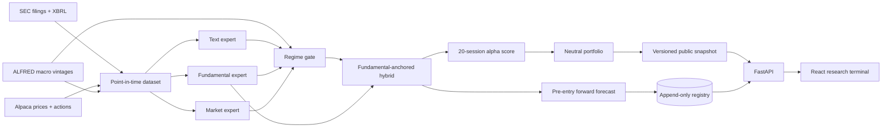

# EDGAR-MoE

Regime-aware multimodal alpha research from SEC filings.

EDGAR-MoE tests whether the predictive value of filing text, XBRL fundamentals, and market features changes with the market regime. A learned Mixture-of-Experts gate combines the modalities, and a cost-aware neutral portfolio translates scores into an auditable research backtest.

> Research software only. It does not provide investment advice, assess suitability, or submit orders.

[Live research terminal](https://edgar-moe.vercel.app) · [API docs](https://edgar-moe.vercel.app/api/docs) · [Frozen locked-test report](reports/authenticated_research_report.md)

> **Authenticated-study status (cutoff 2026-07-31):** complete. The frozen 75%
> fundamental / 25% MoE hybrid achieved rank IC 0.0632 across 2,305 pre-test
> out-of-fold events and 0.0316 across 1,794 locked 2025–2026 events. Its
> cost-aware portfolio was not profitable: at 10 bps, annualized return was
> -3.28% and Sharpe was -0.63 (95% block-bootstrap interval [-2.31, 0.94]). The
> positive predictive relationship weakened out of sample and did not survive
> implementation costs. See the [locked report](reports/authenticated_research_report.md).

## What makes this a quant project

- Every feature has an `available_at` timestamp and fails the build if it exceeds the filing cutoff.
- Development, validation, and locked-test periods are chronological and separated by an embargo.
- The portfolio constrains gross, net, beta, industry, and individual-name exposure.
- Results include baselines, ablations, transaction costs, borrow costs, confidence intervals, and failed hypotheses.
- The bundled public snapshot is derived from the frozen authenticated study; the optional synthetic generator remains explicitly labeled for software verification.
- A separate append-only registry records new forecasts before their tradable entry and appends outcomes only after maturity; it never rewrites the frozen v1 study.

## Architecture



## Quick start

Requirements: Python 3.12, Node.js 24 LTS, `uv`, and npm.

```bash
cp .env.example .env
uv sync --extra research --extra dev --extra operations
npm --prefix apps/web install
```

Start the API and web app in separate terminals:

```bash
uv run edgar-moe serve
npm --prefix apps/web run dev
```

Open `http://localhost:5173`. API documentation is at `http://localhost:8000/api/docs`. The committed snapshot is the authenticated frozen result, so serving the app requires no data credentials.

To verify the model → backtest → export path without touching the authenticated snapshot, write a deterministic synthetic fixture to a separate file:

```bash
uv run edgar-moe demo --epochs 12 --output /tmp/edgar-moe-synthetic.json
uv run python scripts/validate_snapshot.py /tmp/edgar-moe-synthetic.json
```

## Deployment

The public terminal deploys as one Vercel project: Vite emits the React static application, and `api/index.py` exposes FastAPI as one Python Function in Singapore (`sin1`). The frozen v1 snapshot remains stateless. The optional Forward Lab reads from Postgres when `EDGAR_MOE_REGISTRY_DATABASE_URL` is configured; without it, the UI explicitly reports that prospective evidence is not connected.

```bash
npm run build:public
npx vercel@latest
npx vercel@latest --prod
```

The deterministic `public/` bundle is committed because Vercel serves that directory through its CDN before invoking FastAPI; CI rebuilds it, checks its asset graph for publishable secrets/source maps, and rejects source/bundle drift. Vercel also applies browser security headers to the static response, while FastAPI applies the same policy to API responses. Viewing the frozen study requires no database, secrets, or paid data service. A custom domain is optional.

## Prospective forward testing

The production-quality v2 layer is deliberately separate from the historical locked test. It adds SQLAlchemy models and Alembic migrations for datasets, frozen models, runs, forecasts, labels, quality checks, artifacts, and audit events. Immutable records are protected against update/delete operations, batch writes are idempotent, and evidence artifacts use content-addressed SHA-256 keys locally or in Cloudflare R2.

The `Prospective forward cycle` GitHub Actions workflow runs at 07:17 UTC Tuesday
through Saturday. It resolves the cutoff in `America/New_York`, restores only
immutable filing/embedding caches, refreshes current source data, rebuilds the
point-in-time dataset from a bounded 730-day prospective window, forecasts before
the next NYSE entry, settles any matured labels, and mirrors the exact local
content identities into private Cloudflare R2. The window retains the history
needed for 252-session market features and prior annual filings without rebuilding
the 2016-present training corpus. It never retrains or reselects the frozen model.

The runner checkpoints verified filing bodies before FinBERT starts and writes
each embedding atomically. A five-hour inner compute deadline leaves GitHub one
hour to save those reusable caches, including after an incomplete attempt; the
next run resumes from the newest attempt-specific cache.

Processed dataset IDs include the verified source-manifest digest, so retrying a
cutoff after the source checkpoint changes creates a new immutable identity rather
than mutating a previously registered dataset.

Initialize a free local SQLite registry and inspect it:

```bash
uv run edgar-moe forward-init
uv run edgar-moe forward-status
```

After building a current point-in-time dataset, run the frozen model. The timestamp defaults to the current UTC clock and cannot be backdated by more than 15 minutes. An event is eligible only when `accepted_at <= forecast_as_of < entry_at < horizon_at`.

```bash
uv run edgar-moe forward-forecast \
  --dataset-dir data/processed/<current-dataset-id> \
  --model-config config/forward.yaml

# After the 20-session outcomes mature and a later dataset is built:
uv run edgar-moe forward-settle \
  --dataset-dir data/processed/<later-dataset-id> \
  --model-config config/forward.yaml
```

For faster engineering feedback, a read-only five-session diagnostic can be
generated from the same immutable scores and daily-return components:

```bash
uv run edgar-moe forward-diagnostic \
  --dataset-dir data/processed/<later-dataset-id> \
  --horizon-sessions 5 \
  --output reports/forward-diagnostic.json
```

This report never writes labels to the registry and must not replace the official
20-session evaluation or be presented as a résumé performance claim.

For a hosted free-tier setup, set `EDGAR_MOE_REGISTRY_DATABASE_URL` to a migrated Postgres database (for example Neon) in the API host. R2 is optional: the existing registry keeps stable `local://` identities and sets `EDGAR_MOE_ARTIFACT_MIRROR_BACKEND=r2` plus its endpoint, bucket, and credentials only on the private forecasting runner. The public API is read-only; forecasting and settlement are CLI-only operations. See the [forward-testing operations guide](docs/forward-testing.md).

## Authenticated research run

Create free Alpaca and FRED API keys and put them in `.env`. Set `SEC_USER_AGENT` to an application name plus your real contact email. Credentials are read only at runtime and never written into a dataset or snapshot.

First build the security master from the current SEC exchange file plus active and inactive Alpaca assets. Review every non-confident mapping in the generated evidence file before treating the universe as research-ready.

```bash
uv run edgar-moe build-universe \
  --output config/universe.csv \
  --review-output data/interim/security-mapping-review.json

uv run edgar-moe screen-universe \
  --source config/universe.csv \
  --output config/universe.research.csv \
  --as-of 2026-07-31 \
  --candidate-count 500
```

Then execute the pipeline in explicit stages:

```bash
# 1. Resumable, hashed source checkpoint
uv run edgar-moe refresh-data \
  --universe config/universe.research.csv \
  --as-of 2026-07-31 \
  --config config/authenticated-free.yaml \
  --resume

# 2. Filing parsing, frozen FinBERT embeddings, point-in-time XBRL/market/macro features
uv run edgar-moe build-dataset \
  --checkpoint data/raw/authenticated/2026-07-31 \
  --embedder finbert \
  --device cpu \
  --config config/authenticated-free.yaml

# 3. Expanding 2023/2024 walk-forward selection; the locked test is never scored
uv run edgar-moe walk-forward-study \
  --dataset-dir data/processed/<dataset-id> \
  --config config/authenticated-free.yaml

# 4. Only after reviewing and recording the selection hash; run exactly once
uv run edgar-moe open-frozen-test \
  --dataset-dir data/processed/<dataset-id> \
  --selection data/artifacts/walk-forward/<dataset-id>/walk-forward-selection.json \
  --confirm-selection-hash <reviewed-selection-sha256> \
  --publish-snapshot data/demo/snapshot.json
```

`screen-universe` removes probable funds/ETPs and ranks operating-company candidates by trailing free IEX dollar volume. The free authenticated configuration uses 500 screened candidates and a prior-month top-300 model universe. This is a deliberate compute/data-budget compromise and its current-membership survivorship limitation remains disclosed.

`refresh-data` downloads complete 10-K/10-Q histories and filing HTML, point-in-time company facts, split-adjusted Alpaca/IEX daily bars and corporate actions, and initial-release FRED/ALFRED observations. It excludes issuers without eligible periodic forms before market collection, stores large SEC payloads and filings as gzip, streams bars to disk, supports resuming an interrupted cutoff, and verifies SHA-256 hashes before returning.

`build-dataset` constructs a prior-month liquid universe, attaches an availability record to every feature, rejects look-ahead violations, caches text embeddings, and censors labels that have not matured. `walk-forward-study` refits preprocessing and models independently in expanding 2023 and 2024 folds, compares 33 standalone and anchored candidates, and freezes the champion by worst-fold rank IC. It writes content-hashed out-of-fold predictions and never transforms, predicts, or evaluates the locked rows.

The earlier single-window diagnostic remains in `reports/validation_report.md`;
the walk-forward report supersedes it for model selection. `open-frozen-test`
verified the selection and OOF-prediction hashes before accessing locked outcomes,
refit only the frozen champion, and wrote a non-overwritable result. The public
snapshot and final report disclose the complete outcome, including the negative
cost-aware portfolio result and the recovery audit for an initial pre-persistence
timezone failure.

The five-company `config/universe.example.csv` and `--embedder hashing` are connectivity fixtures only. They must never be used to claim market performance. A credible run uses the reviewed broad universe and the configured FinBERT encoder.

Raw, processed, and model artifacts are ignored by Git. Public snapshots contain derived research output only; they do not redistribute source market data. The historical site can still run from one immutable snapshot; Postgres is used only for the optional prospective registry. Local research tables remain Parquet/NPZ files with hash manifests.

The scheduled GitHub job builds and validates a temporary synthetic fixture without changing the frozen public snapshot. The authenticated checkpoint job is manual, requires all four repository secrets plus a reviewed `config/universe.csv`, and retains its private bundle for seven days. It never opens the locked test or publishes signals automatically.

## Repository map

| Area | Responsibility |
|---|---|
| `src/edgar_moe/data` | SEC, Alpaca, ALFRED clients; authenticated refresh; security mappings; analytical storage; demo pipeline |
| `src/edgar_moe/features` | Filing text, XBRL ratios, market features, and availability audits |
| `src/edgar_moe/modeling` | Fold-only preprocessing, baselines, shrinkage-gated PyTorch MoE, anchored hybrids, deterministic walk-forward selection |
| `src/edgar_moe/backtest` | Neutral allocation, event-driven accounting, costs, and inference metrics |
| `src/edgar_moe/api` | Versioned, snapshot-backed FastAPI contract |
| `src/edgar_moe/forward` | Frozen inference, append-only registry, label settlement, artifact storage, and forward metrics |
| `apps/web` | React/TypeScript research terminal |

## Research contract

- Forms: 10-K and 10-Q; amendments excluded.
- Entry: first NYSE open strictly after SEC acceptance.
- Primary target: 20-session beta-adjusted abnormal return.
- Universe: monthly liquid common-stock universe using only trailing information.
- Splits: development through 2022, validation in 2023–2024, locked test from 2025.
- Base portfolio: 100% gross, ≤2% net, ≤0.05 beta, ≤5% SIC-industry, ≤2% per name.
- Cost scenarios: 10/25/50 bps plus 2%/5% annual borrow sensitivity.

See [architecture](docs/architecture.md), [data card](docs/data-card.md), [model card](docs/model-card.md), the [research runbook](docs/research-runbook.md), and the [research report](reports/research_report.md).

For a concise, accurate project description tailored to a one-page résumé, see the [CV entry](docs/cv-entry.md).

## Quality checks

```bash
uv run pytest
uv run ruff check .
uv run mypy src
python scripts/validate_public_bundle.py
npm --prefix apps/web run test
npm --prefix apps/web run build
```

The project is licensed under the MIT License. Source datasets retain their own terms and redistribution restrictions.
