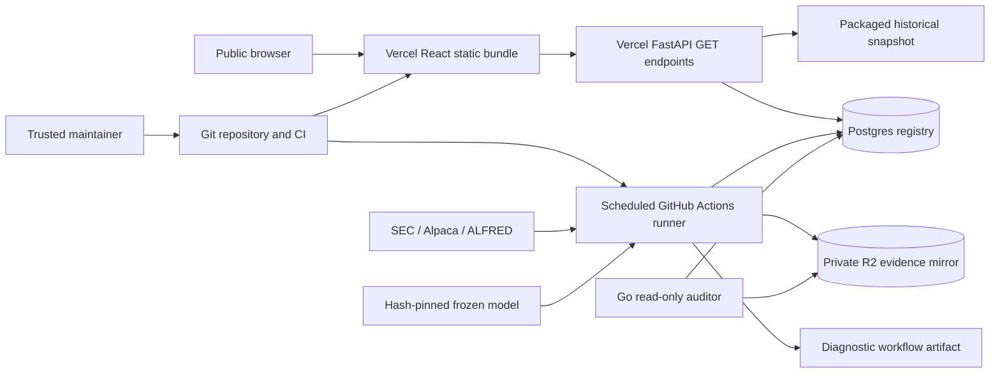

# Architecture and data flow

## Invariants

1. Source payloads are immutable and content-hashed.
2. A feature is valid only when `available_at <= accepted_at` for its filing event.
3. Market features use observations through the previous completed session.
4. XBRL facts use the SEC filing timestamp, not the fiscal period end.
5. Model preprocessing is fitted independently inside each training fold.
6. The locked test is evaluated after the model family, features, costs, and constraints are frozen.
7. Historical endpoints read a derived snapshot; prospective endpoints read the registry. Neither needs raw licensed market data or training dependencies.
8. The one-time evaluator requires the exact walk-forward selection hash and refuses locked-artifact overwrites.
9. A dependency upgrade cannot silently change frozen-v1 inference: the private compatibility audit records the runtime and reproduced scores, and the comparison gate fails closed before a frozen-inference upgrade is accepted ([ADR 0021](adr/0021-frozen-runtime-compatibility-gate.md)).

## Storage layers

- `raw`: cached source responses, ignored by Git.
- `interim`: parsed filings, security mappings, and normalized facts.
- `processed`: Parquet event/availability/return tables plus compressed feature arrays.
- `artifacts`: model states, preprocessors, experiment manifests, and reports.
- `demo`: small public snapshot consumed by FastAPI and React.

Each authenticated layer has a JSON manifest recording source identity, configuration, row counts, paths, and SHA-256 digests. Historical research pages use a validated snapshot. The Live tracking page (`/forward`) uses a Postgres registry containing forecast evidence, appended outcomes, and mutable run status. The read-only governance endpoint exposes the frozen-v1 identity, public-data boundary, repository-enforced controls, and current forward status as one machine-readable contract. The public API exposes reads only; the private runner performs writes.

## Failure behavior

- SEC requests identify the application, run below the published maximum rate, retry transient failures, and cache filing HTML.
- Ambiguous CIK/security mappings receive a confidence status; low-confidence events are excluded from primary results.
- Missing text or fundamentals activate a modality mask rather than zero-valued evidence.
- Missing market sessions censor the primary label and appear in the attrition report; corporate-action records are retained for mapping and return-quality review.
- The weekly workflow builds a verification snapshot but does not publish a new production snapshot. Failure does not replace the committed public snapshot; consumers should inspect the separate freshness endpoint rather than assume a recent deployment means recent research data.

## Deployment boundary

Training uses PyTorch and Transformers outside the serving tier. The deployed FastAPI function contains no training stack; it serves historical snapshot JSON and prospective registry reads. The Vercel source boundary excludes the research lockfile, private research caches, and operator tree, retaining only the reviewed snapshot-lock validator inputs. The function-level boundary repeats those data exclusions and explicitly includes the derived demo snapshot plus its reviewed lock. `SnapshotRepository` verifies the lock before serving and rechecks it when either file changes, so a local checkout with raw filings or forward artifacts cannot create an oversized or identity-drifting serving bundle. The function therefore installs the core serving dependencies from `pyproject.toml`. The React application performs visualization and filtering but no model inference or order routing. A provider-neutral Docker image packages the same serving boundary for a future container host, including the reviewed lock as a non-secret runtime input; it is non-root, healthchecked, and does not include the private forward runner or source-data credentials.

The operator-run copilot is a separate egress boundary: its provider adapter
accepts HTTPS for remote providers and loopback HTTP for local runtimes, then
uses a no-redirect opener so a provider response cannot silently move the
request to another origin. Redirects fail closed and are not included in the
transient retry policy. The provider key and evidence context remain outside
the public API and browser bundle. Remote HTTPS endpoints must also match the
exact hostname allowlist configured for the operator; loopback HTTP is the
explicit local-development exception. Once an allowlisted evidence tool is called,
the agent binds every citation digest to the exact canonical tool payload and
the requested capability, then requires citation closure: a final answer
without a tool-generated citation is rejected rather than retained as an
apparently valid uncited response.

The provider egress decision is recorded in [ADR 0010](adr/0010-copilot-provider-redirect-boundary.md).
The provider-host decision is recorded in [ADR 0013](adr/0013-copilot-provider-host-allowlist.md).
The citation-closure decision is recorded in [ADR 0012](adr/0012-copilot-citation-closure.md).
The citation-payload binding decision is recorded in [ADR 0014](adr/0014-copilot-citation-payload-binding.md).
The API database-session decision is recorded in [ADR 0011](adr/0011-api-read-only-statement-boundary.md).
The XBRL fact-selection policy is recorded in [ADR 0015](adr/0015-xbrl-fact-selection-policy.md).
Database-level registry immutability is recorded in [ADR 0016](adr/0016-database-append-only-triggers.md).
The post-v1 model-selection protocol is recorded in [ADR 0017](adr/0017-post-v1-selection-protocol.md).
Workflow action pinning and secret scoping are recorded in [ADR 0018](adr/0018-workflow-supply-chain.md).

## Architecture baseline — September 18, 2026

This is a repository-backed description, not a certification of cloud account
settings. See the [serving/batch decision record](adr/0001-separate-serving-and-batch.md),
the [frozen-v1/prospective-evaluation decision record](adr/0002-freeze-v1-prospective-evaluation.md),
and the [improvement plan](architecture-roadmap.md). Provider quotas, backup configuration,
database grants, branch protection, and billing settings were not inspected.

### Context and requirements

The primary user is a researcher inspecting reproducible historical results and
timestamped prospective evidence. The maintainer operates ingestion and evaluation.
This is not a broker, order-routing service, or real-time trading system.

Priorities, in order: evidence integrity; understandable failure behavior;
reproducibility; affordable operation; usable presentation. A missed forecast is
preferable to inventing a pre-entry timestamp or revising a recorded prediction.
The budget objective is zero recurring spend within available allowances, not an
unconditional promise that hosting and data services remain free.

### Components and flows

| Component | Responsibility | Boundary / source of truth |
| --- | --- | --- |
| React + `public/` | Display research and operational status | Public by design; never store credentials here |
| `api/index.py`, `src/edgar_moe/api/app.py` | Snapshot, governance, and registry queries | No training or mutation endpoints; governance fields are value-safe and provider-neutral |
| Postgres | Forecasts, labels, identities, runs, quality checks | Prospective record of truth; SQLite is the local/test alternative |
| `scripts/run_forward_cycle.py` | Refresh, build, forecast, settle, diagnose | Batch execution, not a web request |
| `ops/frozen/`, `config/forward.yaml` | Reviewed inference artifact and identities | Hash-pinned model; code review governs changes to the pins; private runtime-compatibility evidence is required for dependency upgrades ([ADR 0021](adr/0021-frozen-runtime-compatibility-gate.md)) |
| Local artifacts + R2 mirror | Content-addressed evidence bytes | Mirrored identity checks; bucket access/retention still require account verification |
| Actions caches | Reusable filings, embeddings, model downloads | Performance optimization, not a backup; a separate least-privilege maintenance job retains only the two newest forward-runtime entries |
| Optional alert webhook | Receives redacted failed-run and health classifications | Secret is runner-only; delivery is best-effort and never contains database/R2 credentials |
| Go evidence auditor | Cross-check registry rows against object bytes | Read-only operational boundary; no repair or write authority |
| Research copilot | Operator-run LLM explanation, evidence navigation, diagnostic-history comparison, human quality review, and bounded usage observability | Bounded read-only tools, transient-only retry policy, content-addressed aggregate wall-clock and UTF-8 context budgets checked before provider calls; answer envelopes are verified at generation, CLI write, benchmark, and evaluation boundaries before review, while citation closure after evidence-tool use, citations, frozen identity, content-addressed policy/tool-contract identity, aggregate identity consistency, structural evaluation, append-only rubric history, hash-pinned readiness, and non-sensitive request/latency/token/peak-context telemetry are retained; legacy or mixed agent boundaries remain review-required; diagnostic history is explicitly supplied and independently verified; no forecast, registry, artifact, or GitHub writes |

Production workflow sequence: restore caches and verify model → refresh inputs →
build dataset → commit pre-entry forecasts → settle mature outcomes → produce
five-session diagnostic. Forecasts and settlements have separate run records.
Twenty-session recorded labels remain the official evaluation; the diagnostic and
earliest-event audits are supplementary and must be labeled as such.

### Trust boundaries and integrity limits

- Browser → API: anonymous public reads. CORS is not authorization. Pagination
  bounds response sizes, but does not by itself prevent scraping or request floods.
- API → database: GET-only routes reduce exposure. The API now prefers
  `EDGAR_MOE_REGISTRY_READ_DATABASE_URL`; local SQLite compatibility falls back to
  the writer URL, while a missing reader URL never falls back to a hosted Postgres
  writer. The API reader also uses a bounded per-instance connection pool
  (`EDGAR_MOE_REGISTRY_API_POOL_SIZE`, `EDGAR_MOE_REGISTRY_API_MAX_OVERFLOW`, and
  `EDGAR_MOE_REGISTRY_API_POOL_TIMEOUT_SECONDS`) to limit serverless connection
  fan-out, requests `default_transaction_read_only=on`, and applies the bounded
  `EDGAR_MOE_REGISTRY_API_STATEMENT_TIMEOUT_MS` Postgres statement timeout.
  These are defense-in-depth controls; provider/project limits and the deployed
  role grants still require external verification. The shared database session
  helper can commit, so the deployed reader role must still be granted
  SELECT-only privileges and verified before claiming database-enforced least
  privilege.
- Runner → providers/database/R2: high-trust execution with source and write
  credentials. Workflow permissions are `contents: read`, but job secrets remain
  powerful. Review workflow and dependency changes as privileged code changes.
- External sources → features: input hashes and availability checks support
  provenance; they cannot guarantee upstream truth or eliminate every research bias.
- Application → evidence store: ORM listeners block normal evidence updates and
  deletes. Raw SQL and database administrators can bypass these listeners. Hashes
  detect mismatches against a trusted reference; they are not independent notarization.
- Database → object store: these are separate commits, not one distributed
  transaction. Forecast rows are appended before batch evidence storage. A mirror
  failure may leave committed forecasts and a failed run. Reconcile by IDs and
  hashes; never erase evidence to make a retry look clean.

### Deployment and operations

`vercel.json` builds the React application into both the framework's native
`apps/web/dist` directory and the deterministic `public/` output directory,
checks that the disclosure files exist, packages the Python API, and requests
`sin1`. CI remains the authoritative deployment-contract and publishable-bundle
validation gate; the Vercel build itself must not be assumed to wait for CI
unless account settings enforce that gate.

The forward workflow pins Ubuntu 24.04, runs Tuesday–Saturday at 07:17 UTC,
serializes production jobs, and has a 300-minute compute deadline inside a
360-minute job. The application reports a 96-hour freshness window. These are
configured behaviors, not guaranteed scheduler latency or availability SLAs.

Forecast list/performance routes request 60-second caching; registry status and
governance are `no-store`. An unconfigured registry is reported explicitly; database errors
produce an unavailable status or 503 on forward data routes. Historical snapshot
reads have a separate dependency path. Snapshot health alone does not prove that
the registry or scheduler is healthy.

No independently verified restore drill, end-to-end alert delivery, cloud-role
audit, or capacity benchmark is established by this baseline. The checked-in
reader-role grant contract and verifier make least-privilege verification
repeatable, but no provider grant has been independently verified yet. The
[restore-rehearsal runbook](restore-rehearsal.md) defines an isolated recovery
procedure, but no restore result has been recorded. The roadmap defines the
evidence needed to close those gaps without adding unnecessary services.
