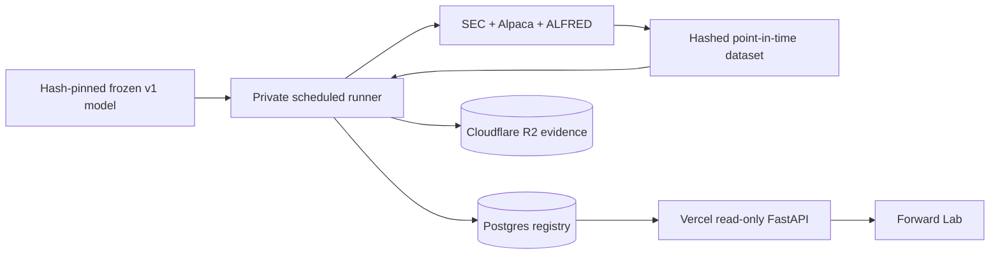

# Forward-testing operations

This guide operates the prospective v2 layer. It does not modify, retrain, or reinterpret the frozen v1 locked study.

## Integrity contract

A row is a forward forecast only when all of the following are true:

1. The model file, selection, and locked result match the reviewed SHA-256 values in `config/forward.yaml`.
2. The feature dataset verifies every Parquet/NPZ asset hash and has zero point-in-time availability violations.
3. The forecast clock is timezone-aware and within 15 minutes of the machine clock.
4. The SEC filing was available before the forecast, while the configured market entry and outcome horizon are both still in the future.
5. The forecast is committed before any outcome is read. A later settlement run appends one label and never changes the original score, rank, expert weights, or timestamps.

The application prevents normal ORM updates and deletes for evidence tables and stores canonical payload hashes in an audit trail. Database administrators still have physical write authority, so durable evidence should also be exported to a versioned, access-restricted R2 bucket with retention policies.

## Local setup

```bash
uv sync --extra research --extra dev --extra operations
uv run edgar-moe forward-init
uv run edgar-moe forward-status
```

The default URL is `sqlite:///data/forward/registry.sqlite3`. Both the database and local content-addressed artifacts live under ignored `data/forward/` paths.

Apply every schema change through Alembic:

```bash
uv run alembic upgrade head
uv run alembic check
```

## Hosted free-tier topology



- Use a Postgres database such as Neon for the registry and require TLS. Keep the
  writer URL (`EDGAR_MOE_REGISTRY_DATABASE_URL`) only in the private runner and
  migration environment. Configure a separate SELECT-only reader URL
  (`EDGAR_MOE_REGISTRY_READ_DATABASE_URL`) in the API host; the API prefers it and
  falls back to a writer URL only when that URL is local SQLite. A missing reader
  URL never causes a hosted API to use the Postgres writer credential.
- Provision the API/auditor role from the trusted migration connection with
  [`ops/postgres/provision-reader.sql`](../ops/postgres/provision-reader.sql), then
  run `scripts/verify_postgres_reader.py` with the reader URL. The verifier checks
  effective privileges and rolled-back UPDATE, DELETE, and DDL probes; a green
  application test is not evidence that the provider grants are correct.
- Use Cloudflare R2 only for non-public model/run evidence. Create a scoped token for one bucket; do not expose R2 credentials to the browser.
- Vercel serves the React bundle and read-only GET endpoints. It never trains, forecasts, settles labels, or holds market-data credentials.
- The application remains useful without Postgres: historical v1 pages load normally and Forward Lab reports that its registry is disconnected.

Production environment variables:

```text
# Private runner and trusted migration environment only:
EDGAR_MOE_REGISTRY_DATABASE_URL=postgresql://writer:...?...sslmode=require
# API host only (for example Vercel):
EDGAR_MOE_REGISTRY_READ_DATABASE_URL=postgresql://reader:...?...sslmode=require
EDGAR_MOE_ARTIFACT_BACKEND=local
EDGAR_MOE_ARTIFACT_MIRROR_BACKEND=r2
EDGAR_MOE_R2_ENDPOINT_URL=https://<account-id>.r2.cloudflarestorage.com
EDGAR_MOE_R2_BUCKET=<private-bucket>
EDGAR_MOE_R2_ACCESS_KEY_ID=<scoped-key>
EDGAR_MOE_R2_SECRET_ACCESS_KEY=<scoped-secret>
```

Keeping `local` as the primary backend preserves the immutable `local://` model
identity created by the first production run. The mirror writes the same key,
digest, and byte count to R2 and fails the run if R2 returns a different content
identity. Only the private runner needs R2 credentials; do not add them to Vercel.

After first enabling R2, mirror and verify evidence created before the scheduled
runner existed:

```bash
uv run edgar-moe forward-mirror-artifacts
```

Before or after a retry, verify that every database artifact reference still
resolves to a hash- and size-verified local object:

```bash
uv run edgar-moe forward-reconcile-artifacts \
  --output data/forward/diagnostics/artifact-reconciliation.json
```

The default command is read-only. With an explicit `--repair`, it mirrors only
registry-referenced objects that pass the local content-addressed checks; it
never edits forecasts, labels, run state, or database artifact rows:

```bash
uv run edgar-moe forward-reconcile-artifacts --repair \
  --output data/forward/diagnostics/artifact-reconciliation.json
```

The report fails on missing/corrupt local bytes, unsupported primary URIs, or a
mirror identity mismatch. It does not invent replacements for missing objects;
recover those from an independently verified source, then rerun the command.
The independent Go auditor remains the authority for checking the durable R2
object store.

If a mirrored forecast or settlement write fails after the local primary has
accepted the bytes, the workflow records that primary reference in the registry
before marking the run failed. The original forecasts/labels remain unchanged;
the failed run is intentionally visible and the reference is now discoverable by
the read-only reconciler. Run the repair command above after the mirror is
available, verify its report, and retry with a new workflow run identity. Do not
delete the failed run or overwrite its evidence to make the retry appear atomic.

Run migrations from a trusted machine before connecting the API. The migration
URL must be the writer role; do not use the API reader URL for schema changes:

```bash
EDGAR_MOE_REGISTRY_DATABASE_URL='<postgres-url>' uv run edgar-moe forward-init
```

Create the reader role once as a database owner, preferably entering its password
interactively rather than placing it in a shell history:

```sql
CREATE ROLE edgar_moe_api_reader LOGIN NOSUPERUSER NOCREATEDB NOCREATEROLE NOINHERIT;
\password edgar_moe_api_reader
```

Then apply the checked-in grant contract as the migration owner:

```bash
psql "$EDGAR_MOE_REGISTRY_DATABASE_URL" \
  -v api_reader_role=edgar_moe_api_reader \
  -v migration_owner=edgar_moe_migrator \
  -f ops/postgres/provision-reader.sql
EDGAR_MOE_REGISTRY_READ_DATABASE_URL="$READER_URL" \
  uv run python scripts/verify_postgres_reader.py
```

The verifier must pass before putting the reader URL in Vercel. Keep the writer
URL out of the API host; if the reader is unavailable, the API intentionally
reports the registry as disconnected rather than using a more powerful credential.

The pull-request CI job also provisions the same contract in a disposable
PostgreSQL 16 service and runs the verifier as the reader role. That catches SQL,
schema, and privilege-regression mistakes before deployment; it is not a
substitute for a redacted verification report from the hosted provider.

## Scheduled production runner

`.github/workflows/forward-production.yml` runs at 07:17 UTC Tuesday through
Saturday. That is after the prior SEC acceptance window in both U.S. daylight and
standard time and leaves several hours before the next regular NYSE open. The
workflow uses `scripts/run_forward_cycle.py`; manual dispatch can provide an
explicit source cutoff for recovery, but the script refuses a date later than the
current `America/New_York` date. Production refreshes use a 730-day rolling source
window rather than the 2016-present model-development history. This preserves more
than the 252 sessions required by the longest market feature, includes prior annual
filings for text deltas, and keeps frozen-model inference tractable on a free CPU
runner. `--lookback-days` can increase the window but cannot reduce it below 400
calendar days.

Configure these GitHub Actions repository secrets before merging the workflow to
the default branch:

```text
ALPACA_API_KEY
ALPACA_API_SECRET
FRED_API_KEY
SEC_USER_AGENT
EDGAR_MOE_REGISTRY_DATABASE_URL
EDGAR_MOE_R2_ENDPOINT_URL
EDGAR_MOE_R2_BUCKET
EDGAR_MOE_R2_ACCESS_KEY_ID
EDGAR_MOE_R2_SECRET_ACCESS_KEY
# Optional independent Go audit (SELECT-only DB role and read-only R2 token):
EDGAR_MOE_REGISTRY_AUDITOR_DATABASE_URL
EDGAR_MOE_R2_AUDITOR_ACCESS_KEY_ID
EDGAR_MOE_R2_AUDITOR_SECRET_ACCESS_KEY
# Optional HTTPS webhook for redacted failure/health alerts:
EDGAR_MOE_ALERT_WEBHOOK_URL
```

Use the pooled Neon URL for the scheduled application connection. Apply Alembic
migrations separately with a direct URL. Create a private R2 bucket and restrict
the S3 token to object read/write access for that bucket only.

The job restores a bounded cache containing immutable filing bodies, FinBERT
embeddings, and Hugging Face weights. Submissions, XBRL facts, daily bars,
corporate actions, and ALFRED vintages are downloaded fresh on every cycle. The
reviewed 1.6 MB inference artifact and locked-result binding live under
`ops/frozen/` and are SHA-256 verified before use; processed training data is not
committed. A new empty registry must therefore be bootstrapped once from the
trusted machine so its immutable training-dataset identity is registered.

Verified filing bodies are promoted into the reusable cache immediately after the
source checkpoint passes hash verification. FinBERT then reports filing, cache-hit,
and newly encoded counts every 250 records and writes every `.npz` entry through an
atomic rename. The compute command has a 300-minute deadline inside a 360-minute
job. Whether the command succeeds or reaches that internal deadline, GitHub saves
the filing, embedding, and Hugging Face caches under a unique run-attempt key. A
timed-out attempt still fails visibly, but the next attempt restores its completed
work instead of starting from zero.

If refresh, inference, or settlement fails, the workflow writes a redacted
`forward-failure-context.json` containing the commit, cutoff, attempt, and step
outcome, uploads it with any diagnostic already produced, and adds a failure
summary to the run. This is durable investigation evidence, not a claim that an
external alert recipient has been configured.

If `EDGAR_MOE_ALERT_WEBHOOK_URL` is configured, the runner sends a redacted
HTTPS JSON alert after a failed cycle and after a successful cycle whose status
is stale, unavailable, or has quality warnings/failures. Delivery is
best-effort (`continue-on-error`) so a notification outage cannot hide the
original run result. The payload contains only operational identifiers and
machine-readable classification; database URLs, R2 credentials, raw exception
messages, and source data are never copied. Without the optional secret the
steps skip delivery at no cost. When configured, the workflow retains a
redacted delivery receipt with the alert dedupe key and HTTP result for 30 days;
the receipt never contains the webhook URL.

If `EDGAR_MOE_REGISTRY_AUDITOR_DATABASE_URL` is configured, the same scheduled
job runs the independent Go auditor against the R2 mirror after the cycle. It
uses the separate `EDGAR_MOE_R2_AUDITOR_*` read-only token, uploads the JSON
report for 30 days, and fails the workflow on an integrity finding or an
unavailable dependency. A missing optional auditor URL skips this step; it does
not prove that the production mirror was audited.

## Research drift review

The frozen training dataset can be compared with a later processed dataset without
opening the locked test or changing the model. The command verifies the reviewed
model and locked-result hashes, scores both datasets through the inference-only
component path, and writes a content-hashed report:

```bash
uv run edgar-moe research-drift \
  --baseline-dataset data/processed/finbert/<frozen-training-dataset-id> \
  --prospective-dataset data/processed/finbert/<later-dataset-id> \
  --output reports/research-drift.json
```

The report measures per-feature missingness, quantiles, standardized mean shift,
population-stability index, and frozen expert/component outputs. A warning is a
research review signal, not an availability incident or an automatic retraining
trigger. The report records the dataset/source identities, frozen artifact and
selection hashes, and an immutable-report hash. It intentionally does not read
targets, labels, daily returns, or registry state.

Each processed dataset ID includes the verified source-manifest digest. If a
manual retry refreshes the same cutoff with different source evidence, it creates
a new immutable dataset identity instead of overwriting or conflicting with the
previous attempt in the registry.

## Forecast run

Refresh and build a dataset whose cutoff includes newly accepted filings but whose next-session entries have not occurred. Then run:

```bash
uv run edgar-moe forward-forecast \
  --dataset-dir data/processed/<dataset-id> \
  --model-config config/forward.yaml \
  --device cpu
```

A successful zero-row batch is valid: it proves the checks ran but no event met the strict pre-entry condition. Do not loosen the timestamp rule to populate the UI.

The run writes:

- a mutable run state (`running` to `succeeded` or `failed`);
- immutable dataset/model identities;
- immutable forecast rows and quality checks;
- a canonical forecast-batch JSON artifact addressed by its SHA-256;
- audit events for every state transition.

## Label settlement

After at least one recorded horizon has matured, build a newer point-in-time dataset and run:

```bash
uv run edgar-moe forward-settle \
  --dataset-dir data/processed/<later-dataset-id> \
  --model-config config/forward.yaml
```

The command matches by immutable `event_id`, verifies maturity, appends at most one label per forecast, records unmatched due forecasts as a quality warning, and recomputes read-time metrics from forecast/label joins.

## Short-horizon diagnostic

The official forward target remains the 20-session beta-adjusted abnormal return.
When faster engineering feedback is useful, generate a read-only diagnostic from
the same pre-entry forecast scores and the dataset's daily return components:

```bash
uv run edgar-moe forward-diagnostic \
  --dataset-dir data/processed/<later-dataset-id> \
  --horizon-sessions 5 \
  --output reports/forward-diagnostic.json
```

The command does not create a run, append labels, or alter the registry. It is a
short-horizon observation of the frozen score, not a replacement for the primary
20-session evaluation. Keep its results separate from the résumé/CV evidence. The
scheduled production workflow generates this report after each successful cycle
and uploads it as a GitHub Actions artifact retained for 30 days.

If a rolling dataset no longer contains an older event row, the report uses the
forecast's immutable security and entry metadata and reports total, matched,
pending, and unmatched counts separately. Coverage is evaluated observations
divided by all forecasts, including unmatched rows in the denominator. Unmatched
rows are not counted as pending. `unmatched_reasons` and `unmatched_forecasts`
identify missing metadata, calendar dates, benchmark returns, or incomplete
return windows. With no evaluated observations and any unmatched rows, status is
`insufficient_coverage`; waiting alone is not evidence that the data gap will resolve.

New dataset builds retain SPY daily return components even though the benchmark
is outside the filing-issuer universe. Existing processed bundles must be rebuilt
from their source checkpoints to gain those components. Builder version 2 gives
the rebuilt bundle a distinct identity, preserving registered historical bundles.

Each diagnostic also includes `unique_event_evaluation`, selecting the earliest
`forecast_as_of` for each `(model_id, event_id)` before looking at outcome
availability. Ties use ascending `forecast_id`. This avoids giving repeated
workflow forecasts extra weight; different models remain separate. The original
top-level metrics still describe every recorded forecast. The nested report
includes selected IDs, repeated forecast count, observations, and coverage across
all selected events, including those pending or unmatched. If selection metadata
is missing, that evaluation is marked unavailable instead of guessing chronology.
Observation rows include model ID and forecast timestamp for auditability.

## Monitoring and recovery

The independent Go [evidence auditor](evidence-auditor.md) verifies registry
artifact references and object bytes without importing the Python research stack.
Run it with a SELECT-only database role and read-only R2 credentials during a
recovery check. Its findings are diagnostic; it never repairs evidence.

```bash
uv run edgar-moe forward-status
```

The `status` object includes a machine-readable `health_status` (`ok`, `warning`,
or `degraded`), the latest run state, the age of the latest successful run, the
freshness threshold, active-run count, and quality-gate counts. The same payload
is exposed by the read-only `GET /api/v1/forward/status` endpoint and rendered in
Forward Lab, so the dashboard and the scheduled job summary use the same health
decision. The default freshness window is 96 hours, which allows for the
Tuesday–Saturday schedule and its weekend gap.

Monitor failed runs, failed/warning quality checks, dataset freshness, unmatched settlements, registry availability, and the age of the latest successful run. Failed runs remain in the ledger. Fix the source problem and start a new run; never delete or repurpose the failed identity.

Capture a cost/capacity baseline before increasing the universe, lookback, or
hosting tier:

```bash
uv run edgar-moe capacity-baseline \
  --snapshot data/demo/snapshot.json \
  --path data/forward \
  --path data/cache/forward-filings \
  --path data/artifacts/embedding-cache-finbert \
  --api-url https://your-deployment.example \
  --workflow-runtime-seconds 630 \
  --output reports/capacity-baseline.json
```

The report measures local cold/warm snapshot loads, representative read-path
latencies, registry query timings, file counts/bytes, and disk headroom. It
retains an operator-supplied workflow runtime when available. Managed database
connection counts, object-storage usage, account quotas, and billing limits are
marked `not_observed` until the hosted environment is measured; the report
therefore cannot be used to claim that a provider tier is free. The stop and
warning disk thresholds are recorded in the report, and paid usage remains an
explicit approval decision.

The optional notifier maps these conditions to `failed_run`, `stale_runner`,
`registry_unavailable`, `quality_failure`, and `quality_warning` events. Use
`uv run python scripts/notify_forward_alert.py --dry-run` with a saved context
or status payload to review the redaction contract before configuring a
recipient. A successful local dry run is not evidence that an external channel
received a message.

Back up Postgres using the provider's export/restore process and periodically verify that downloaded R2 objects match their recorded SHA-256. Rotate database and R2 credentials immediately after suspected exposure.

Use the [restore-rehearsal runbook](restore-rehearsal.md) for an isolated
database restore, table-count comparison, evidence audit, and local API read-path
check. A backup that has not been restored and verified is not recovery evidence.
