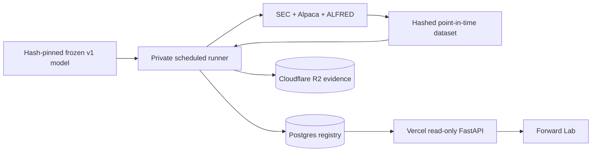

# Forward-testing operations

This guide operates the prospective v2 layer. It does not modify, retrain, or reinterpret the frozen v1 locked study.

## Integrity contract

A row is a forward forecast only when all of the following are true:

1. The model file, selection, and locked result match the reviewed SHA-256 values in `config/forward.yaml`.
2. The feature dataset verifies every Parquet/NPZ asset hash and has zero point-in-time availability violations.
3. The forecast clock is timezone-aware and within 15 minutes of the machine clock.
4. The SEC filing was available before the forecast, while the configured market entry and outcome horizon are both still in the future.
5. The forecast is committed before any outcome is read. A later settlement run appends one label and never changes the original score, rank, expert weights, or timestamps.

The application prevents normal ORM updates and deletes for evidence tables and stores canonical payload hashes in an audit trail. Database administrators still have physical write authority, so durable evidence should also be exported to a versioned, access-restricted R2 bucket with retention policies.

## Local setup

```bash
uv sync --extra research --extra dev --extra operations
uv run edgar-moe forward-init
uv run edgar-moe forward-status
```

The default URL is `sqlite:///data/forward/registry.sqlite3`. Both the database and local content-addressed artifacts live under ignored `data/forward/` paths.

Apply every schema change through Alembic:

```bash
uv run alembic upgrade head
uv run alembic check
```

## Hosted free-tier topology



- Use a Postgres database such as Neon for the registry. Keep its connection string only in the private runner and Vercel environment; require TLS.
- Use Cloudflare R2 only for non-public model/run evidence. Create a scoped token for one bucket; do not expose R2 credentials to the browser.
- Vercel serves the React bundle and read-only GET endpoints. It never trains, forecasts, settles labels, or holds market-data credentials.
- The application remains useful without Postgres: historical v1 pages load normally and Forward Lab reports that its registry is disconnected.

Production environment variables:

```text
EDGAR_MOE_REGISTRY_DATABASE_URL=postgresql://...?...sslmode=require
EDGAR_MOE_ARTIFACT_BACKEND=local
EDGAR_MOE_ARTIFACT_MIRROR_BACKEND=r2
EDGAR_MOE_R2_ENDPOINT_URL=https://<account-id>.r2.cloudflarestorage.com
EDGAR_MOE_R2_BUCKET=<private-bucket>
EDGAR_MOE_R2_ACCESS_KEY_ID=<scoped-key>
EDGAR_MOE_R2_SECRET_ACCESS_KEY=<scoped-secret>
```

Keeping `local` as the primary backend preserves the immutable `local://` model
identity created by the first production run. The mirror writes the same key,
digest, and byte count to R2 and fails the run if R2 returns a different content
identity. Only the private runner needs R2 credentials; do not add them to Vercel.

After first enabling R2, mirror and verify evidence created before the scheduled
runner existed:

```bash
uv run edgar-moe forward-mirror-artifacts
```

Run migrations from a trusted machine before connecting the API:

```bash
EDGAR_MOE_REGISTRY_DATABASE_URL='<postgres-url>' uv run edgar-moe forward-init
```

## Scheduled production runner

`.github/workflows/forward-production.yml` runs at 07:17 UTC Tuesday through
Saturday. That is after the prior SEC acceptance window in both U.S. daylight and
standard time and leaves several hours before the next regular NYSE open. The
workflow uses `scripts/run_forward_cycle.py`; manual dispatch can provide an
explicit source cutoff for recovery, but the script refuses a date later than the
current `America/New_York` date.

Configure these GitHub Actions repository secrets before merging the workflow to
the default branch:

```text
ALPACA_API_KEY
ALPACA_API_SECRET
FRED_API_KEY
SEC_USER_AGENT
EDGAR_MOE_REGISTRY_DATABASE_URL
EDGAR_MOE_R2_ENDPOINT_URL
EDGAR_MOE_R2_BUCKET
EDGAR_MOE_R2_ACCESS_KEY_ID
EDGAR_MOE_R2_SECRET_ACCESS_KEY
```

Use the pooled Neon URL for the scheduled application connection. Apply Alembic
migrations separately with a direct URL. Create a private R2 bucket and restrict
the S3 token to object read/write access for that bucket only.

The job restores a bounded cache containing immutable filing bodies, FinBERT
embeddings, and Hugging Face weights. Submissions, XBRL facts, daily bars,
corporate actions, and ALFRED vintages are downloaded fresh on every cycle. The
reviewed 1.6 MB inference artifact and locked-result binding live under
`ops/frozen/` and are SHA-256 verified before use; processed training data is not
committed. A new empty registry must therefore be bootstrapped once from the
trusted machine so its immutable training-dataset identity is registered.

## Forecast run

Refresh and build a dataset whose cutoff includes newly accepted filings but whose next-session entries have not occurred. Then run:

```bash
uv run edgar-moe forward-forecast \
  --dataset-dir data/processed/<dataset-id> \
  --model-config config/forward.yaml \
  --device cpu
```

A successful zero-row batch is valid: it proves the checks ran but no event met the strict pre-entry condition. Do not loosen the timestamp rule to populate the UI.

The run writes:

- a mutable run state (`running` to `succeeded` or `failed`);
- immutable dataset/model identities;
- immutable forecast rows and quality checks;
- a canonical forecast-batch JSON artifact addressed by its SHA-256;
- audit events for every state transition.

## Label settlement

After at least one recorded horizon has matured, build a newer point-in-time dataset and run:

```bash
uv run edgar-moe forward-settle \
  --dataset-dir data/processed/<later-dataset-id> \
  --model-config config/forward.yaml
```

The command matches by immutable `event_id`, verifies maturity, appends at most one label per forecast, records unmatched due forecasts as a quality warning, and recomputes read-time metrics from forecast/label joins.

## Monitoring and recovery

```bash
uv run edgar-moe forward-status
```

Monitor failed runs, failed/warning quality checks, dataset freshness, unmatched settlements, registry availability, and the age of the latest successful run. Failed runs remain in the ledger. Fix the source problem and start a new run; never delete or repurpose the failed identity.

Back up Postgres using the provider's export/restore process and periodically verify that downloaded R2 objects match their recorded SHA-256. Rotate database and R2 credentials immediately after suspected exposure.
