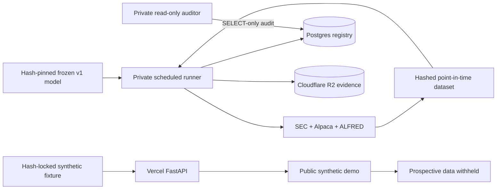

# Forward-testing operations

This guide describes private prospective-v2 operations. It does not modify,
retrain, or reinterpret the frozen v1 locked study. While source-rights review
is unresolved, prospective outputs are withheld from the public application;
the website's status endpoint reports publication policy, not registry health.
This application-level hold is not a rights determination and does not purge
historical files, Git history, workflow artifacts, or prior deployments.

## Integrity contract

A row is a forward forecast only when all of the following are true:

1. The model file, selection, and locked result match the reviewed SHA-256 values in `config/forward.yaml`.
2. The feature dataset verifies every Parquet/NPZ asset hash and has zero point-in-time availability violations.
3. The forecast clock is timezone-aware and within 15 minutes of the machine clock.
4. The SEC filing was available before the forecast, while the configured market entry and outcome horizon are both still in the future.
5. The forecast is committed before any outcome is read. A later settlement run appends one label and never changes the original score, rank, expert weights, or timestamps.

The checked-in frozen runtime bundle is cross-validated before CI and scheduled
execution with:

```bash
uv run python scripts/validate_frozen_runtime.py
```

This check binds `ops/frozen/SHA256SUMS`, `ops/frozen/frozen-model.pt`,
`ops/frozen/locked-test.json`, and `config/forward.yaml` to one reviewed v1
identity. It does not permit prospective observations to replace that identity.

The application prevents ORM updates and deletes for evidence tables and stores canonical payload hashes in an audit trail. Migration `20260921_0002` also enforces the contract in the database: evidence rows reject `UPDATE`, `DELETE`, and `TRUNCATE` from any client, and a run may record its outcome only once, while it is `running` ([ADR 0016](adr/0016-database-append-only-triggers.md)). Database owners can still drop triggers with DDL, so durable evidence should also be exported to a versioned, access-restricted R2 bucket with retention policies.

CI applies the migrations to a fresh, disposable PostgreSQL database and attempts direct SQL updates, deletes, and truncations against every protected table. Those checks prove the migration-installed PostgreSQL triggers reject writes at the database boundary; the SQLite tests separately cover the local development schema. The integration test refuses non-loopback URLs, any database name other than `edgar_moe_immutability_test`, and databases that already contain registry rows.

## Local setup

```bash
uv sync --extra research --extra dev --extra operations
uv run edgar-moe forward-init
uv run edgar-moe forward-status
```

The default URL is `sqlite:///data/forward/registry.sqlite3`. Both the database and local content-addressed artifacts live under ignored `data/forward/` paths.

Apply every schema change through Alembic:

```bash
uv run alembic upgrade head
uv run alembic check
```

## Hosted free-tier topology


```mermaid
flowchart LR
  JOB[Private scheduled runner] --> DATA[SEC + Alpaca + ALFRED]
  DATA --> DS[Hashed point-in-time dataset]
  MODEL[Hash-pinned frozen v1 model] --> JOB
  DS --> JOB
  JOB --> PG[(Postgres registry)]
  JOB --> R2[(Cloudflare R2 evidence)]
  AUDITOR[Private read-only auditor] -->|SELECT-only audit| PG
  SNAP[Hash-locked synthetic fixture] --> API[Vercel FastAPI]
  API --> UI[Public synthetic demo]
  UI --> HOLD[Prospective data withheld]
```

- Use a Postgres database such as Neon for private registry operations and
  require TLS. Keep the writer URL (`EDGAR_MOE_REGISTRY_DATABASE_URL`) only in
  the private runner and migration environment. The public Vercel function does
  not connect to Postgres and must not receive either registry URL. A separate
  SELECT-only reader URL (`EDGAR_MOE_REGISTRY_READ_DATABASE_URL`) is for
  explicitly authorized private audit workflows, not public serving.
- Provision the private audit role from the trusted migration connection with
  [`ops/postgres/provision-reader.sql`](../ops/postgres/provision-reader.sql), then
  run `scripts/verify_postgres_reader.py` with the reader URL. The verifier checks
  effective privileges and rolled-back UPDATE, DELETE, and DDL probes; a green
  application test is not evidence that the provider grants are correct.
- For a repeatable provider audit, add the exact SELECT-only URL as the
  `EDGAR_MOE_REGISTRY_READ_DATABASE_URL` GitHub Actions secret, then manually run
  **Provider reader contract audit** from the Actions tab. The job never prints the
  URL, retains the redacted role report, failure output, run metadata, and SHA-256
  file list for 30 days, and fails when the secret is absent or any forbidden probe
  succeeds. A successful local CI service test is not a substitute for this
  provider-specific run; do not configure the writer URL as the secret.
- Use Cloudflare R2 only for non-public model/run evidence. Create a scoped token for one bucket; do not expose R2 credentials to the browser.
- Vercel serves the React bundle and hash-locked synthetic fixture. It never
  trains, forecasts, settles labels, connects to the registry, or holds source
  credentials. Historical research evidence and all prospective registry
  endpoints are withheld while rights review remains open.
- The private runner and auditor continue to use their separately scoped
  credentials. The public `/forward` page explains the publication hold; it does
  not claim that the database is disconnected or report private registry health.

Production environment variables:

```text
# Private runner and trusted migration environment only:
EDGAR_MOE_REGISTRY_DATABASE_URL=postgresql://writer:...?...sslmode=require
# Optional authorized private audit workflow only (never Vercel):
EDGAR_MOE_REGISTRY_READ_DATABASE_URL=postgresql://reader:...?...sslmode=require
# R2 credentials belong only to the private runner/auditor that needs them.
EDGAR_MOE_ARTIFACT_BACKEND=local
EDGAR_MOE_ARTIFACT_MIRROR_BACKEND=r2
EDGAR_MOE_R2_ENDPOINT_URL=https://<account-id>.r2.cloudflarestorage.com
EDGAR_MOE_R2_BUCKET=<private-bucket>
EDGAR_MOE_R2_ACCESS_KEY_ID=<scoped-key>
EDGAR_MOE_R2_SECRET_ACCESS_KEY=<scoped-secret>
```

Keeping `local` as the primary backend preserves the immutable `local://` model
identity created by the first production run. The mirror writes the same key,
digest, and byte count to R2 and fails the run if R2 returns a different content
identity. Only the private runner needs R2 credentials; do not add them to Vercel.

After first enabling R2, mirror and verify evidence created before the scheduled
runner existed:

```bash
uv run edgar-moe forward-mirror-artifacts
```

Before or after a retry, verify that every database artifact reference still
resolves to a hash- and size-verified local object:

```bash
uv run edgar-moe forward-reconcile-artifacts \
  --output data/forward/diagnostics/artifact-reconciliation.json
```

The default command is read-only. With an explicit `--repair`, it mirrors only
registry-referenced objects that pass the local content-addressed checks; it
never edits forecasts, labels, run state, or database artifact rows:

```bash
uv run edgar-moe forward-reconcile-artifacts --repair \
  --output data/forward/diagnostics/artifact-reconciliation.json
```

The report fails on missing/corrupt local bytes, unsupported primary URIs, or a
mirror identity mismatch. It does not invent replacements for missing objects;
recover those from an independently verified source, then rerun the command.
The independent Go auditor remains the authority for checking the durable R2
object store.

If a mirrored forecast or settlement write fails after the local primary has
accepted the bytes, the workflow records that primary reference in the registry
before marking the run failed. The original forecasts/labels remain unchanged;
the failed run is intentionally visible and the reference is now discoverable by
the read-only reconciler. Run the repair command above after the mirror is
available, verify its report, and retry with a new workflow run identity. Do not
delete the failed run or overwrite its evidence to make the retry appear atomic.

Run migrations from a trusted machine before connecting the API. The migration
URL must be the writer role; do not use the API reader URL for schema changes:

```bash
EDGAR_MOE_REGISTRY_DATABASE_URL='<postgres-url>' uv run edgar-moe forward-init
```

Create the reader role once as a database owner, preferably entering its password
interactively rather than placing it in a shell history:

```sql
CREATE ROLE edgar_moe_api_reader LOGIN NOSUPERUSER NOCREATEDB NOCREATEROLE NOINHERIT;
\password edgar_moe_api_reader
```

Then apply the checked-in grant contract as the migration owner:

```bash
psql "$EDGAR_MOE_REGISTRY_DATABASE_URL" \
  -v api_reader_role=edgar_moe_api_reader \
  -v migration_owner=edgar_moe_migrator \
  -f ops/postgres/provision-reader.sql
EDGAR_MOE_REGISTRY_READ_DATABASE_URL="$READER_URL" \
  uv run python scripts/verify_postgres_reader.py
```

The verifier must pass before using the reader URL in a private audit workflow.
Never put either URL in Vercel. The public API has no registry dependency, so
registry health must be checked with the local CLI or an authorized private
operator workflow.

The pull-request CI job also provisions the same contract in a disposable
PostgreSQL 16 service and runs the verifier as the reader role. That catches SQL,
schema, and privilege-regression mistakes before deployment; it is not a
substitute for a redacted verification report from the hosted provider.

## Scheduled production runner

`.github/workflows/forward-production.yml` is scheduled for 07:17 UTC Tuesday
through Saturday. That is the intended cutoff after the prior SEC acceptance
window in both U.S. daylight and standard time, but GitHub's scheduler does not
provide a start-time SLO. The workflow uses `scripts/run_forward_cycle.py`; manual
dispatch can provide an explicit source cutoff for recovery, but the script
refuses a date later than the current `America/New_York` date. Production
refreshes use a 730-day rolling source window rather than the 2016-present
model-development history. This preserves more than the 252 sessions required by
the longest market feature, includes prior annual filings for text deltas, and
keeps frozen-model inference tractable on a free CPU runner. `--lookback-days`
can increase the window but cannot reduce it below 400 calendar days.

### Versioned embedding-cache prewarm

After a reviewed `uv.lock` change that alters the FinBERT/Torch cache identity,
the first production run may need to encode every filing again. To move that
compute off the forecast run, manually dispatch **Prewarm forward embedding
cache** on `main` before the next scheduled cycle. Leave `cutoff` empty for the
current U.S. source cutoff; enter an explicit valid cutoff only when recovering
an earlier cycle. The job refreshes the same 730-day source window and builds
the dataset with the same CPU encoder and cache paths as production. Its runner
stops before `forward-forecast`, `forward-settle`, and `forward-status`; it has
no registry or R2 credentials and cannot publish prospective evidence.

The workflow shares the production concurrency group, so it cannot run beside
an active cycle. Dispatch it when no production run is pending: GitHub may
replace an older pending run in the same group. It saves a lockfile-keyed GitHub
Actions cache on success. A production run restores the newest compatible
runtime cache through its prefix fallback; inspect its `build-dataset` log for
text-cache hits and encodes to confirm the warm cache was actually used. A
successful prewarm is **not** a successful forecast, and cache restoration is
best-effort: if a cache expires, is evicted, or a runtime identity changes
again, production safely re-encodes. Re-running prewarm for the same cutoff and
lockfile uses the same cache key, but consumes hosted-runner minutes; run it
only when a cold encode would threaten the forecast window. The existing
production cache-maintenance job prunes older runtime caches after a cycle.

The schedule has a structural coverage gap. A filing accepted before the open
(06:00-09:30 ET) enters at that same morning's open, after the pre-dawn run has
already finished, so no scheduled run can score it before entry. In the frozen
study, 13.1% of events were pre-market filings, and 12.9% could not be reached by
a 03:17 ET Tuesday-Saturday schedule. The prospective sample therefore
under-represents pre-market filers relative to the locked test. Each forecast run
records the gap as an informational `missed_before_entry` quality check: the
number of events accepted after the previous successful forecast run whose entry
had already passed. It also records `pre_open_schedule_margin`, the actual time
between forecast recording and the target entry open. On a trading day, the
target is that day's open even when the run has already missed it, so a late run
records zero margin rather than incorrectly measuring to the following session.
A margin under 90 minutes is a warning and is included in the existing
status/webhook alert path; it does not change the cutoff, backdate a forecast, or
authorize a model change. The check measures the application-side margin only;
resolving scheduler latency still requires an external scheduling decision.

Configure these GitHub Actions repository secrets before merging the workflow to
the default branch:

```text
ALPACA_API_KEY
ALPACA_API_SECRET
FRED_API_KEY
SEC_USER_AGENT
EDGAR_MOE_REGISTRY_DATABASE_URL
EDGAR_MOE_R2_ENDPOINT_URL
EDGAR_MOE_R2_BUCKET
EDGAR_MOE_R2_ACCESS_KEY_ID
EDGAR_MOE_R2_SECRET_ACCESS_KEY
# Optional independent Go audit (SELECT-only DB role and read-only R2 token):
EDGAR_MOE_REGISTRY_AUDITOR_DATABASE_URL
EDGAR_MOE_R2_AUDITOR_ACCESS_KEY_ID
EDGAR_MOE_R2_AUDITOR_SECRET_ACCESS_KEY
# Optional HTTPS webhook for redacted failure/health alerts:
EDGAR_MOE_ALERT_WEBHOOK_URL
```

The three independent-auditor secrets are an all-or-none group. Configure all
three to enable the post-cycle Go audit, or leave all three empty to skip it.
After the runtime is installed, the workflow fails closed on a partial
configuration before source refresh or the Go audit; it reports only missing
variable names and never prints a database URL or credential value.

Use the pooled Neon URL for the scheduled private runner. A private audit
workflow that queries Postgres should use the SELECT-only role and a provider
endpoint verified to accept the required read-only and timeout options. The
public Vercel API no longer creates SQLAlchemy pools or queries Postgres; the
historic API pool and session settings are not part of the current serving path.
Apply Alembic migrations separately with a direct writer URL. Create a private
R2 bucket and restrict the S3 token to object read/write access for that bucket
only.

The job restores a bounded cache containing immutable filing bodies, FinBERT
embeddings, and Hugging Face weights. Submissions, XBRL facts, daily bars,
corporate actions, and ALFRED vintages are downloaded fresh on every cycle. The
`refresh-data --filing-cache` path writes or verifies the dated request contract
before it hard-links cached filings into that checkpoint. A seed failure can
therefore resume against the same request, while an unidentified preexisting
partial checkpoint still fails closed. This ordering repairs the 2026-09-26
forward-cycle failure where the runner seeded files first and then tripped the
request-contract guard. That failed run stopped during refresh, before forecast
or settlement; the code fix is not evidence of a successful subsequent cycle.
Do not trigger a new provider-backed cycle solely to demonstrate the repair
while the [source-rights review](https://github.com/hoangnguyen2003/edgar-moe/issues/280)
is unresolved.

The reviewed 1.6 MB inference artifact and locked-result binding live under
`ops/frozen/` and are SHA-256 verified before use; processed training data is not
committed. A new empty registry must therefore be bootstrapped once from the
trusted machine so its immutable training-dataset identity is registered.

Verified filing bodies are promoted into the reusable cache immediately after the
source checkpoint passes hash verification. FinBERT then reports filing, cache-hit,
and newly encoded counts every 250 records and writes every `.npz` entry through an
atomic rename. The compute command has a 300-minute deadline inside a 360-minute
job. Whether the command succeeds or reaches that internal deadline, GitHub saves
the filing, embedding, and Hugging Face caches under a unique run-attempt key. A
timed-out attempt still fails visibly, but the next attempt restores its completed
work instead of starting from zero.

After the cycle job finishes, a separate cache-maintenance job uses a token with
only `actions: write` and no production secrets. It lists the `forward-runtime-*`
cache family, retains the two newest entries, and deletes older entries through the
GitHub cache API, then checks that total Actions cache usage is below the 10 GB
repository quota. This keeps resumability while preventing one roughly 1.4 GB
entry per run from consuming the repository cache quota. If the maintenance job
cannot list or delete caches, or the quota remains exceeded, it fails visibly for
operator follow-up; it never touches registry rows, evidence objects, or the frozen
model.

If refresh, inference, or settlement fails, the workflow writes a redacted
`forward-failure-context.json` containing the commit, cutoff, attempt, and step
outcome, uploads it with any diagnostic already produced, and adds a failure
summary to the run. This is durable investigation evidence, not a claim that an
external alert recipient has been configured.

The registry's public `error_message` field is provider-neutral: third-party
database/object-store/request exceptions are recorded by type, while
application state-machine details are compacted and credential-bearing URLs or
assignments are redacted. Detailed provider diagnostics remain in the private
workflow error artifact rather than the anonymous API response.
The runner's terminal stderr uses the same provider-neutral policy, so a failed
refresh cannot copy a driver URL or credential-bearing exception into the
workflow log.

Every forward attempt also writes `forward-evidence-manifest.json`. It records
the safe workflow context, the relative paths declared for diagnostics/status/
alert evidence, each file's size and SHA-256 when present, and explicit missing
files when a prior step did not produce them. The workflow verifies the
manifest before uploading a consolidated 30-day evidence artifact. A missing
optional diagnostic is therefore visible rather than silently treated as a
successful run.

If `EDGAR_MOE_ALERT_WEBHOOK_URL` is configured, the runner sends a redacted
HTTPS JSON alert after a failed cycle and after a successful cycle whose status
is stale, unavailable, or has quality warnings/failures.

One class of warning is deliberately excluded from that rule. Most runs score
nothing, because no filing was accepted that day: eight of the nine runs before
2026-09-23 recorded a `prospective_candidate_count` warning for exactly that
reason. Paging daily for the normal case is how an operator learns to ignore the
channel, so a run whose **only** warnings are expected ones does not raise an
alert. The warning is still appended to the private registry; it simply does
not page. A warning of any other kind, a warning alongside an expected one,
a failure, a failed run, staleness, and an unavailable registry all still
alert. The alert payload names the checks that warned, so a recipient can
see which condition it is. Delivery is
best-effort (`continue-on-error`) so a notification outage cannot hide the
original run result. The payload contains only operational identifiers and
machine-readable classification; database URLs, R2 credentials, raw exception
messages, and source data are never copied. Without the optional secret the
steps skip delivery at no cost. When configured, the workflow retains a
redacted delivery receipt with the alert dedupe key and HTTP result for 30 days;
the receipt never contains the webhook URL. Receipts include a payload hash and
their own SHA-256 content hash. A local, non-delivery rehearsal can inspect the
redaction and verify the retained receipt without contacting a recipient:

```bash
uv run python scripts/notify_forward_alert.py \
  --dry-run \
  --failure-context data/forward/diagnostics/forward-failure-context.json \
  --receipt /tmp/edgar-moe-alert-receipt.json
uv run python scripts/verify_forward_alert_receipt.py \
  --receipt /tmp/edgar-moe-alert-receipt.json
```

This proves the local payload and receipt contract only; it does not prove that
an external alert channel accepted a message.

If `EDGAR_MOE_REGISTRY_AUDITOR_DATABASE_URL` is configured, the same scheduled
job runs the independent Go auditor against the R2 mirror after the cycle. It
uses the separate `EDGAR_MOE_R2_AUDITOR_*` read-only token, uploads the JSON
report for 30 days, and fails the workflow on an integrity finding or an
unavailable dependency. It passes `-failed-run-window 12h`, so failed runs from
earlier cycles are counted in `historical_failed_runs` instead of failing every
later cycle; they are immutable and were reported when they happened. A missing
optional auditor URL skips this step; it does not prove that the production
mirror was audited. The workflow passes each secret only to the steps that use
it ([ADR 0018](adr/0018-workflow-supply-chain.md)).

## Research drift review

The frozen training dataset can be compared with a later processed dataset without
opening the locked test or changing the model. The command verifies the reviewed
model and locked-result hashes, scores both datasets through the inference-only
component path, and writes a content-hashed report:

```bash
uv run edgar-moe research-drift \
  --baseline-dataset data/processed/finbert/<frozen-training-dataset-id> \
  --prospective-dataset data/processed/finbert/<later-dataset-id> \
  --output reports/research-drift.json
```

The report measures per-feature missingness, quantiles, standardized mean shift,
population-stability index, and frozen expert/component outputs. A warning is a
research review signal, not an availability incident or an automatic retraining
trigger. The report records the dataset/source identities, frozen artifact and
selection hashes, and an immutable-report hash. It intentionally does not read
targets, labels, daily returns, or registry state.

A representative target-free run is retained at
[`reports/research-drift-2026-08-06.json`](../reports/research-drift-2026-08-06.json).
It compares the frozen 2026-07-31 dataset (5,961 events) with the later
2026-08-06 dataset (6,039 events) and reports stable distributions for all 807
feature columns and 9 frozen component outputs, with no warnings or dimension
mismatches. Its report hash is
`0899bdfb3a108cfbf91f8b273de6d50ddb6907bc8612cbfdf64d45d9d9fb8e24`. This is
an evidence snapshot, not a claim of predictive performance or a trigger for
automatic retraining.

The retained [`research-drift-history.json`](../reports/research-drift-history.json)
records this one observation with status `insufficient_history` and requires two
more later reports before a stable trend can be declared. Its history hash is
`0275db162c2e5c8121cc9ab5ff68997bf9d92b88205198dc933195d9f44f7929`.

When several later datasets are available, aggregate their immutable reports for
review instead of treating one comparison as a trend:

```bash
uv run edgar-moe research-drift-history \
  --report reports/research-drift-2026-08-06.json \
  --report reports/research-drift-2026-09-15.json \
  --report reports/research-drift-2026-10-15.json \
  --minimum-reports 3 \
  --output reports/research-drift-history.json
```

The history command verifies every child hash and requires one baseline, frozen
model identity, and threshold set across all reports. It orders observations by
prospective dataset date, rejects duplicate dataset IDs, marks fewer than three
observations as `insufficient_history`, and exposes warning streaks for human
review. It never retrains, reads outcomes, or changes the frozen artifact.

To verify a retained history later without reopening the source reports, run:

```bash
uv run edgar-moe research-drift-history-verify \
  reports/research-drift-history.json
```

The verifier checks the immutable scope, identities, timestamps, observation
ordering, child-report references, aggregate status, warning streak, and final
content hash. A valid hash alone is not enough to make a malformed history
acceptable.

Before using the trend as a human research-review input, run the separate
readiness gate:

```bash
uv run edgar-moe research-drift-readiness \
  reports/research-drift-history.json \
  --minimum-reports 3 \
  --output /tmp/research-drift-readiness.json
```

The gate revalidates the retained history and exits `0` only when the requested
number of later observations is present, the history is stable, and no review
state or warning streak remains. `insufficient_history`, `error`, and
`incomplete` histories are `blocked`; warning histories are `review_required`.
The output is a hash-pinned structural decision containing no outcomes,
credentials, or provider payloads. It is not a performance claim, model
promotion decision, or retraining authorization.

Each processed dataset ID includes the verified source-manifest digest. If a
manual retry refreshes the same cutoff with different source evidence, it creates
a new immutable dataset identity instead of overwriting or conflicting with the
previous attempt in the registry.

## Forecast run

Refresh and build a dataset whose cutoff includes newly accepted filings but whose next-session entries have not occurred. Then run:

```bash
uv run edgar-moe forward-forecast \
  --dataset-dir data/processed/<dataset-id> \
  --model-config config/forward.yaml \
  --device cpu
```

A successful zero-row batch is valid: it proves the checks ran but no event met the strict pre-entry condition. Do not loosen the timestamp rule to populate the UI.

The run also records these source-coverage checks:

- `dataset_freshness_days`, a warning when the dataset is more than four days old;
- `recent_filing_download_failures`, a warning when filings accepted within seven
  days failed to download and so could not be scored;
- `missed_before_entry`, informational coverage telemetry for the schedule gap
  described above;
- `pre_open_schedule_margin`, a warning when the actual recording time is less
  than 90 minutes before the target entry open (including a zero-margin warning
  when that day's open has already passed).

When a blocking gate fails, such as the point-in-time availability audit, the
failed check is recorded with the failed run. The frozen predictor also refuses
datasets built with a different XBRL fact policy than its training data
([ADR 0015](adr/0015-xbrl-fact-selection-policy.md)).

The run writes:

- a mutable run state (`running` to `succeeded` or `failed`);
- immutable dataset/model identities;
- immutable forecast rows and quality checks;
- a canonical forecast-batch JSON artifact addressed by its SHA-256;
- audit events for every state transition.

## Label settlement

After at least one recorded horizon has matured, build a newer point-in-time dataset and run:

```bash
uv run edgar-moe forward-settle \
  --dataset-dir data/processed/<later-dataset-id> \
  --model-config config/forward.yaml
```

The command matches by immutable `event_id`, verifies maturity, appends at most one label per forecast, records unmatched due forecasts as a quality warning, and recomputes read-time metrics from forecast/label joins.

## What this test can and cannot show

The forward test records about 14 forecasts a week: one to four filings per run,
five runs a week. Treating settled forecasts as independent - which is generous,
since filings scored on the same day share a trading day - a 95% interval
excludes zero only when `1.96 / sqrt(n)` drops below the true rank IC:

| True rank IC | Settled forecasts needed | Time at the current rate |
| --- | --- | --- |
| 0.03, the locked test's figure | about 4,300 | about 6 years |
| 0.05 | about 1,500 | about 2 years |
| 0.10 | about 400 | about 6 months |

So the live test cannot confirm an edge the size of the one the study measured,
and will not be able to for years. These counts are optimistic lower bounds:
the calculation above treats individual outcomes as independent, while
same-period filings and overlapping 20-session labels are correlated. A
strong deterioration may become visible sooner, but one short run is not a
reliable diagnosis of model failure.

That is not a reason to stop running it. What it demonstrates, from the first
run, is the part that is usually asserted rather than shown:

- every forecast is recorded before its entry time, and the database rejects any
  attempt to change it afterwards;
- outcomes are appended only once the horizon has matured, and the settlement
  match rate is recorded;
- the model, dataset, and selection identity behind each forecast are pinned to
  the frozen artifacts;
- the pipeline's own quality checks are published with the numbers behind them.

Those are claims about process integrity, and a small sample proves them as well
as a large one. The statistical claim is the one that needs years. The private
registry diagnostic treats the point estimate as a running log and withholds a
time-clustered interval until enough calendar history exists. The public app
currently withholds this entire prospective output pending rights review.

## How the live rank IC is computed

The private forward rank IC is a **single Spearman correlation over every settled
(score, realized return) pair**, pooled across runs. It is not the average of
per-run cross-sectional correlations, which is the usual definition of an
information coefficient.

The reason is the batch size. A run scores the filings accepted since the
previous run, which in production has meant one to four filings; a
cross-sectional correlation over a single filing does not exist, and over two
it takes only the values -1 and 1. Averaging such figures would report noise
with a respectable-looking name.

The cost of pooling is that the figure mixes cross-sectional ordering with
variation between periods, so it is not comparable to the locked study's rank
IC, which was computed over a far larger cross-section. Both limits are why the
private calculation withholds a statistical reading below 100 settled outcomes:

- The private registry performance calculation uses [`forward/uncertainty.py`](../src/edgar_moe/forward/uncertainty.py)
  to draw 1,000 deterministic bootstrap samples of **two consecutive UTC
  calendar months**. Every filing accepted in the same month moves together;
  overlapping month blocks retain some dependence across adjacent months.
  The 2.5th and 97.5th percentiles form a conditional 95% interval. The
  resampling design follows the moving-block method of
  [Künsch (1989)](https://projecteuclid.org/journals/annals-of-statistics/volume-17/issue-3/The-Jackknife-and-the-Bootstrap-for-General-Stationary-Observations/10.1214/aos/1176347265.full).
- Bounds remain `null` until at least **100 settled pairs in 12 distinct
  acceptance months** exist. The response names the interval status, month
  count, block length, and resample count instead of treating 24 filings from
  one month as 24 independent time observations. An undefined correlation,
  too many degenerate resamples, more than 5,000 settled pairs, or an
  acceptance-date span above 120 months also leaves bounds `null` with an
  explicit reason; the capacity cases require review before extending the
  public calculation.
- The calculation is capped at 1,000 replicates and cached for at most eight
  unchanged settled cohorts within a warm process. It is a conditional
  descriptive interval, **not** a correction for model selection, long-lived
  market-regime changes, issuer dependence beyond these time blocks, or a
  guarantee that future performance will match the observed period.
- The older `rank_ic_interval()` in [`forward/metrics.py`](../src/edgar_moe/forward/metrics.py)
  remains an explicitly independence-assuming diagnostic helper; neither the
  public registry nor the read-only offline audits publish its bounds. The
  official-outcome audit uses the same calendar-block method on its
  earliest-per-event sample and requires an aware acceptance timestamp for
  every settled forecast. Its interval need not equal the registry interval,
  which retains repeated forecasts. The short-horizon diagnostic reports no
  confidence bounds, even when it has enough pairs for the older helper to
  calculate an independence-assuming interval.
- The current public `/forward` page withholds prospective outcomes, so it does
  not display this private metric. If a later release is considered for public
  publication, it must first restore these evidence and uncertainty gates and
  pass source-rights review; no current API response implies approval.

## Short-horizon diagnostic

The official forward target remains the 20-session beta-adjusted abnormal return.
When faster engineering feedback is useful, generate a read-only diagnostic from
the same pre-entry forecast scores and the dataset's daily return components:

```bash
uv run edgar-moe forward-diagnostic \
  --dataset-dir data/processed/<later-dataset-id> \
  --horizon-sessions 5 \
  --output reports/forward-diagnostic.json
```

The command does not create a run, append labels, or alter the registry. It is a
short-horizon observation of the frozen score, not a replacement for the primary
20-session evaluation. Keep its results separate from the résumé/CV evidence. The
scheduled production workflow generates this report after each successful cycle
and uploads it as a GitHub Actions artifact retained for 30 days.

If a rolling dataset no longer contains an older event row, the report uses the
forecast's immutable security and entry metadata and reports total, matched,
pending, and unmatched counts separately. Coverage is evaluated observations
divided by all forecasts, including unmatched rows in the denominator. Unmatched
rows are not counted as pending. `unmatched_reasons` and `unmatched_forecasts`
identify missing metadata, calendar dates, benchmark returns, or incomplete
return windows. With no evaluated observations and any unmatched rows, status is
`insufficient_coverage`; waiting alone is not evidence that the data gap will resolve.

New dataset builds retain SPY daily return components even though the benchmark
is outside the filing-issuer universe. Existing processed bundles must be rebuilt
from their source checkpoints to gain those components. Builder version 2 gives
the rebuilt bundle a distinct identity, preserving registered historical bundles.

Each diagnostic also includes `unique_event_evaluation`, selecting the earliest
`forecast_as_of` for each `(model_id, event_id)` before looking at outcome
availability. Ties use ascending `forecast_id`. This avoids giving repeated
workflow forecasts extra weight; different models remain separate. The original
top-level metrics still describe every recorded forecast. The nested report
includes selected IDs, repeated forecast count, observations, and coverage across
all selected events, including those pending or unmatched. If selection metadata
is missing, that evaluation is marked unavailable instead of guessing chronology.
Observation rows include model ID and forecast timestamp for auditability.

### Retain a diagnostic history

When several private diagnostic artifacts have accumulated, build a separate
history for engineering review:

```bash
uv run edgar-moe forward-diagnostic-history \
  --report /private/path/diagnostic-2026-09-17.json \
  --report /private/path/diagnostic-2026-09-18.json \
  --report /private/path/diagnostic-2026-09-19.json \
  --minimum-reports 3 \
  --output reports/forward-diagnostic-history.json

uv run edgar-moe forward-diagnostic-history-verify \
  reports/forward-diagnostic-history.json
```

The command accepts only summaries produced by the diagnostic redaction
boundary. The retained history contains chronological source digests, safe
counts, maturity, coverage, metrics, and the diagnostic horizon. It rejects
raw observations, event/forecast identifiers, duplicate timestamps, mixed
horizons, malformed reports, and tampered history. `insufficient_history` is a
valid explicit status until the configured minimum number of later artifacts
exists; a non-ready diagnostic status produces `review_required`. Verification
never reopens the private source files. A `ready` history means only that the
configured count of structurally valid snapshots was collected. Snapshots may
overlap or reuse forecasts and labels, and statistical independence is
explicitly `not_assessed`; never count `report_count` as independent samples.
The `diagnostic_review_required` flag covers collection and per-report checks;
`human_review_status` remains `not_recorded` until review is documented outside
this immutable artifact. New histories set `promotion_eligible` to `false` and
carry this interpretation in their content-addressed disclaimer. This history
is not the official 20-session evaluation, a performance promotion gate, or a
retraining trigger.

### Build a history from retained GitHub artifacts

The manual **Build forward diagnostic history** Actions workflow makes this
collection repeatable without putting private diagnostics in the repository. In
the Actions tab, provide comma-separated run IDs and the matching
`forward-diagnostic-YYYY-MM-DD` artifact names, in the same order. Each run is
checked before download: it must be a successful `Prospective forward cycle`
run on `main`, triggered by `schedule` or `workflow_dispatch`. The selection is
bounded to eight artifacts and requires at least three by default.

The workflow uses only `actions: read` and `contents: read`, downloads the
source artifacts into the ephemeral runner, and uploads only the redacted,
content-addressed history plus `SHA256SUMS`. Raw diagnostic JSON is never
uploaded by this workflow. A valid `review_required` history is useful evidence
but is not a readiness decision; the history must still be independently
reviewed before it can influence research decisions. Workflow summaries display
the snapshot count, unassessed independence, and non-promotion status explicitly.

### Record a separate human review attestation

The source history remains immutable and keeps `human_review_status` as
`not_recorded`. After reviewing the history's counts, maturity, coverage, metrics,
and limitations, a maintainer may create a separate, content-addressed
self-attestation. The CLI requires separate confirmations that the summary was
reviewed and that its research-only limitations are understood; it does not
infer either acknowledgement from the review decision:

The review/source separation is recorded in
[ADR 0028](adr/0028-forward-history-review-attestations.md).

```bash
uv run edgar-moe forward-diagnostic-history-review \
  --history /path/to/forward-diagnostic-history.json \
  --reviewer-id maintainer \
  --decision acknowledged \
  --confirm-reviewed \
  --acknowledge-limitations \
  --output /private/path/history-review.json

uv run edgar-moe forward-diagnostic-history-review-verify \
  /private/path/history-review.json \
  --history /path/to/forward-diagnostic-history.json
```

Use `--decision follow_up_required` and repeat `--reason-code` with stable
reason codes such as `metric_anomaly` or `maturity_or_coverage_concern` when
review found an issue. Supported codes are `history_status_needs_follow_up`,
`insufficient_history`, `maturity_or_coverage_concern`, `metric_anomaly`,
`provenance_question`, `snapshot_overlap_or_dependence_question`, and
`other_follow_up`. A history whose collection status is not `ready` requires
`follow_up_required`. Use a new output path for each immutable review record;
existing files are never replaced. Free-form notes are deliberately not accepted. The
reviewer identifier is self-reported; SHA-256 detects later content changes but
does not authenticate the person or provide a digital signature. The record
acknowledges that snapshots may overlap, their independence is not assessed,
the history is not the official 20-session evaluation, v1 is immutable, and
neither promotion nor retraining is authorized. It is not a model approval or
performance result. Keep this private operator evidence separate from the
history; it does not rewrite the history's `human_review_status` field.

## Monitoring and recovery

The independent Go [evidence auditor](evidence-auditor.md) verifies registry
artifact references and object bytes without importing the Python research stack.
Run it with a SELECT-only database role and read-only R2 credentials during a
recovery check. Its findings are diagnostic; it never repairs evidence.

```bash
uv run edgar-moe forward-status
```

The private CLI `status` object includes a machine-readable `health_status` (`ok`, `warning`,
or `degraded`), the latest run state, the age of the latest successful run, the
freshness threshold, active-run count, and quality-gate counts. For a settlement,
quality health combines its checks with the most recent preceding forecast on
the same UTC `as_of` date, dataset, and model. A later result for the same check
name supersedes an earlier one; a prior day's forecast cannot carry its warning
into an unpaired settlement. `latest_cycle_forecast_status` shows the paired
forecast state separately from `latest_run_status`, so a failed forecast cannot
be hidden by a later successful settlement. No registry records are rewritten:
status is computed from append-only rows at read time. The public
`GET /api/v1/forward/status` endpoint instead reports only the fixed
`withheld_review` publication policy; it does not inspect the registry. The
default freshness window is 96 hours, which allows for the Tuesday–Saturday
schedule and its weekend gap.

An expected `prospective_candidate_count` warning still appears in health and
quality counts, but does not send a webhook alert by itself. Actionable forecast
warnings such as `pre_open_schedule_margin` remain alertable after settlement.

Monitor failed runs, failed/warning quality checks, dataset freshness, unmatched settlements, registry availability, and the age of the latest successful run. Failed runs remain in the ledger. Fix the source problem and start a new run; never delete or repurpose the failed identity.

Capture a cost/capacity baseline before increasing the universe, lookback, or
hosting tier:

```bash
uv run edgar-moe capacity-baseline \
  --snapshot data/demo/snapshot.json \
  --path data/forward \
  --path data/cache/forward-filings \
  --path data/artifacts/embedding-cache-finbert \
  --api-url https://your-deployment.example \
  --workflow-runtime-seconds 630 \
  --output reports/capacity-baseline.json
```

The report measures local cold/warm snapshot loads, representative read-path
latencies, registry query timings, file counts/bytes, and disk headroom. It
retains an operator-supplied workflow runtime when available. Managed database
connection counts, object-storage usage, account quotas, and billing limits are
marked `not_observed` until the hosted environment is measured; the report
therefore cannot be used to claim that a provider tier is free. The stop and
warning disk thresholds are recorded in the report, and paid usage remains an
explicit approval decision.

The repository also includes a lightweight weekly/manual
`.github/workflows/capacity-baseline.yml` job. It measures the GitHub-hosted
runner with the same command, retains the report for 30 days, and does not make
provider API calls unless the optional repository variable
`EDGAR_MOE_CAPACITY_API_URL` is configured. The hosted-runner observation is
useful for trend comparison but is not a load test or a provider-quota claim.

For an isolated, credential-free read-path check, run
`.venv/bin/python scripts/benchmark_forward_read_path.py --rows 1200 --samples 20`.
It creates and destroys a synthetic SQLite registry, exercises the public
FastAPI read routes sequentially, and reports warm p50/p95/p99 plus an
explicitly cold interval probe. Its [retained baseline and decision](adr/0030-forward-interval-read-path.md)
are useful for local regression investigation, not hosted latency or an SLO.
If the cold interval regresses, compare the same row/settlement count and
Python/runtime on an otherwise idle host, run the uncertainty parity tests,
and inspect DB/network separately before changing the statistical method.

For a bounded hosted read-only observation, use
[`benchmark_hosted_read_path.py`](../scripts/benchmark_hosted_read_path.py) only
after the [deployment smoke check](../scripts/smoke_deployment.py) verifies the
serving identity. It samples four fixed public GET routes sequentially,
reports HTTP/semantic errors and cache mix separately from successful latency,
and refuses to retain response bodies. Its [2026-09-27 observation](hosted-read-path-observation.md)
includes multi-second outliers despite some edge hits; it does not establish
an SLO, concurrency capacity, or a Postgres bottleneck. Keep each output in a
new ignored `data/artifacts/` path and do not run a high-rate load test against
the free production deployment.

The optional notifier maps these conditions to `failed_run`, `stale_runner`,
`registry_unavailable`, `quality_failure`, and `quality_warning` events. Use
`uv run python scripts/notify_forward_alert.py --dry-run` with a saved context
or status payload to review the redaction contract before configuring a
recipient. A successful local dry run is not evidence that an external channel
received a message.

Back up Postgres using the provider's export/restore process and periodically verify that downloaded R2 objects match their recorded SHA-256. Rotate database and R2 credentials immediately after suspected exposure.

Use the [restore-rehearsal runbook](restore-rehearsal.md) for an isolated
database restore, table-count comparison, evidence audit, and local API read-path
check. A backup that has not been restored and verified is not recovery evidence.
