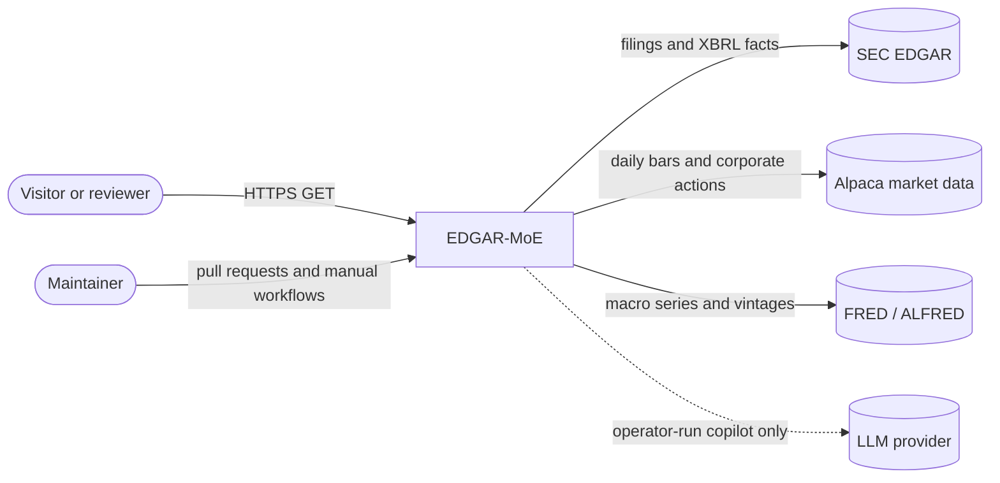
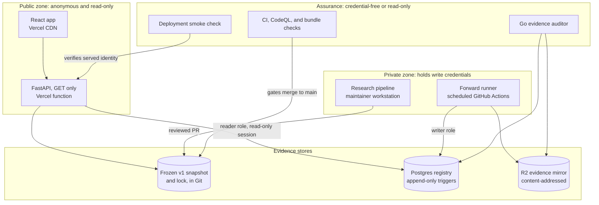
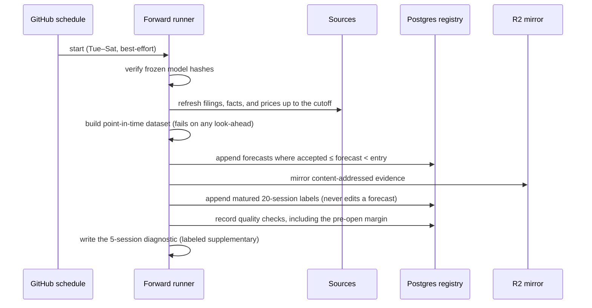

# EDGAR-MoE solution architecture

This is the single entry point to how EDGAR-MoE is designed, deployed, secured,
operated, and verified. It summarizes and links the detailed documents rather
than repeating them. Every claim separates what the code enforces from what
depends on provider configuration or operator action.

- **Status date:** 2026-09-23.
- **Live system:** [edgar-moe.vercel.app](https://edgar-moe.vercel.app), its [API reference](https://edgar-moe.vercel.app/api/docs), and a plain-language [architecture page](https://edgar-moe.vercel.app/architecture) for visitors.
- **Decision log:** [25 architecture decision records](adr/README.md).
- **Detailed views:** [architecture and data flow](architecture.md), [forward-testing operations](forward-testing.md), [improvement plan](architecture-roadmap.md).

## 1. Context and goals

EDGAR-MoE asks whether SEC filings help predict stock returns. It reads each
10-K and 10-Q filing: the text, the XBRL financial statements, and the market
backdrop. A regime-gated mixture of experts then scores how the stock should
perform over the next 20 trading sessions, relative to the market.

The system has two lives:

1. **A finished historical study (frozen v1).** The model was selected on
   2023–2024 validation data, frozen and fingerprinted, then scored once on
   1,794 filings from 2025–2026. The result is published honestly. Ranking skill
   was weak but positive (rank IC 0.0316), and a cost-aware market-neutral
   portfolio lost money (−3.28% a year and a Sharpe ratio of −0.63 at 10 bps).
   See the [locked report](../reports/authenticated_research_report.md) and the
   [model card](model-card.md).
2. **An ongoing prospective test.** A scheduled runner scores new filings with
   the same frozen model. It saves each forecast before the stock can trade, and
   appends each outcome only after 20 sessions. Nothing can be adjusted with
   hindsight.

It is research software. It never places orders, gives advice, or assesses
suitability.

### Stakeholders and concerns

| Stakeholder | Main concern | Where it is addressed |
| --- | --- | --- |
| Visitor or reviewer | What was found, and can I trust it? | The public site's answer-first pages, the Audit page, and [§8](#8-verification-and-traceability) |
| Quant researcher | No look-ahead, honest selection, costs included | [Research contract](../README.md#research-contract), [model card](model-card.md), and [ADR 0017](adr/0017-post-v1-selection-protocol.md) |
| Maintainer (operator) | Cheap, recoverable, observable operation | [§6](#6-reliability-and-operations), [runbooks](#runbooks), and [operator evidence](operator-evidence.md) |
| Data providers | Terms of use and redistribution | [Public-surface review](public-surface-review.md) and the `data-provenance.json` manifest |

### Quality priorities

When they conflict, the priorities apply in this order:

1. evidence integrity;
2. understandable failure behavior;
3. reproducibility;
4. affordable operation;
5. usable presentation.

A missed forecast is always preferable to a backdated one.

### Constraints

- **Cost:** zero recurring spend within free allowances. Paid services need explicit approval.
- **Team:** a single maintainer, with no on-call rotation.
- **Data:** free sources only (SEC EDGAR, the Alpaca IEX feed, FRED/ALFRED), with their gaps disclosed in the [data card](data-card.md).
- **Scheduling:** GitHub Actions schedules are best-effort. In practice, forward runs start 4–5 hours after their cron time ([#156](https://github.com/hoangnguyen2003/edgar-moe/issues/156)).
- **Immutability:** frozen v1 is never retrained. Any change creates a new version, evaluated prospectively ([ADR 0002](adr/0002-freeze-v1-prospective-evaluation.md)).

## 2. Requirements

### Functional

| ID | Requirement |
| --- | --- |
| F1 | Build a point-in-time dataset from filings, XBRL facts, prices, and macro vintages. |
| F2 | Select a model on pre-test folds, freeze it, and evaluate the locked test once. |
| F3 | Backtest a cost-aware, market-neutral long-short portfolio. |
| F4 | Publish the frozen results through a public, read-only site and API. |
| F5 | Record prospective forecasts before entry, and settle outcomes after 20 sessions. |
| F6 | Expose the frozen identity, public-data boundary, and control status for audit. |
| F7 | Offer an operator-run AI copilot that explains evidence with verifiable citations. |

### Quality-attribute scenarios

Each scenario gives a stimulus, the required response, and the current evidence.

| Attribute | Scenario and required response | Evidence today |
| --- | --- | --- |
| Integrity | A forecast is attempted at or after its entry time. It is refused; zero such forecasts are accepted. | Enforced in code and tested ([§8](#8-verification-and-traceability), R2) |
| Integrity | Any client issues `UPDATE`, `DELETE`, or `TRUNCATE` on an evidence row. The database rejects it. | Triggers installed in production ([ADR 0016](adr/0016-database-append-only-triggers.md)) |
| Reproducibility | A deployment serves a snapshot different from the reviewed one. The API refuses to serve it, and the deployment gate fails. | Runtime lock check ([ADR 0004](adr/0004-runtime-snapshot-lock.md)), plus a smoke check that compares identities on every production deploy |
| Availability | The registry database is unreachable. Historical pages still load, and forward data reports unavailable instead of failing silently. | API tests; see the [failure scenarios](architecture-roadmap.md#failure-scenarios-to-exercise) |
| Security | The public serving tier is compromised. It cannot write evidence, because routes are GET-only and sessions read-only. | Enforced in code ([ADR 0011](adr/0011-api-read-only-statement-boundary.md)), and by a SELECT-only provider role verified on 2026-09-22 |
| Security | A credential is committed or bundled. The bundle validator and secret scanning block or flag it. | Enforced in CI; push protection is enabled |
| Timeliness | A scheduled run starts late. Its margin before the open is recorded, with a warning below 90 minutes. | Enforced ([ADR 0020](adr/0020-pre-open-schedule-margin.md)); manual read-only observers verify a selected dispatch and summarize historical scheduled-time, creation-time, and start-time delays. Punctuality and scheduler origin are not guaranteed by GitHub metadata. |
| Research honesty | A headline figure rests on a handful of settled outcomes. The page reports the figure's interval and says it is too early to read, rather than presenting it as a finding. | Enforced ([`rank_ic_interval()`](../src/edgar_moe/forward/metrics.py) and the early-sample notice on Live tracking), and stated with its independence assumption |
| Recoverability | The registry is lost. It can be restored into an isolated target and reconciled with R2 evidence. | Rehearsed locally and in CI. **Pending:** a provider-side drill; the candidate RPO (24 h) and RTO (4 h) are unverified. |
| Performance | A change adds weight to the site. The first visit still downloads under 130 KB of compressed HTML, JavaScript, and CSS, and CI fails when it would not. | Enforced ([`check_web_budget.py`](../scripts/check_web_budget.py), budget in [`config/web_page_weight_budget.json`](../config/web_page_weight_budget.json)); measured at 97 KB on 2026-09-23 |
| Cost | A copilot tool loop or provider outage runs long. Wall-clock and context budgets stop it before the next provider call. | Enforced ([ADR 0008](adr/0008-copilot-run-execution-budget.md), [ADR 0009](adr/0009-copilot-context-budget.md)) |

## 3. Architecture views

### System context



### Containers and trust zones



The main separation ([ADR 0001](adr/0001-separate-serving-and-batch.md)) is
between two tiers:
- The **public tier** holds no write credentials and no training stack.
- The **private tier** holds source and database write credentials, and runs
  only as reviewed code in scheduled or manual workflows.

### The forward cycle



The database and the object store are separate commits, not one distributed
transaction. A mirror failure leaves committed forecasts and a failed run, which
[`forward-reconcile-artifacts`](forward-testing.md) repairs by ID and hash.
Evidence is never erased to make a retry look clean.

### Deployment

| Component | Runs on | Trigger | Credentials | Trust |
| --- | --- | --- | --- | --- |
| React app | Vercel CDN (static `public/`) | Merge to `main` | None | Public |
| FastAPI | Vercel Python function, `sin1` | Merge to `main` | Optional read-only registry URL | Public, read-only |
| Forward runner | GitHub-hosted Ubuntu 24.04 | Cron `17 7 * * 2-6` UTC, or manual | Writer DB, R2, and sources, each scoped per step ([ADR 0018](adr/0018-workflow-supply-chain.md)) | Private |
| Optional scheduler observer | GitHub-hosted Ubuntu 24.04 | Manual `workflow_dispatch` with a run ID | GitHub `actions: read` and `contents: read` only | Read-only evidence |
| Optional scheduler-lateness measurement | GitHub-hosted Ubuntu 24.04 | Manual `workflow_dispatch` with a bounded lookback | GitHub `actions: read` and `contents: read` only | Read-only evidence |
| Optional diagnostic-history collector | GitHub-hosted Ubuntu 24.04 | Manual `workflow_dispatch` with paired forward run IDs and artifact names | GitHub `actions: read` and `contents: read` only | Redacted research evidence |
| Registry | Managed Postgres (Neon) | — | Writer (runner) and reader (API and auditor) | Evidence store |
| Evidence mirror | Cloudflare R2 | — | Runner write; auditor read-only | Evidence store |
| CI | GitHub Actions | Every PR and push | `contents: read` | Gate |
| Smoke check | GitHub Actions | Each production deploy | None | Gate |
| Container image | Built and healthchecked in CI | Every PR | None | Portability option, not deployed |

## 4. Data architecture

- **Layers:** raw → interim → processed → artifacts → public snapshot. Each
  authenticated layer has a manifest with source identity, row counts, and SHA-256
  digests ([storage layers](architecture.md#storage-layers)).
- **Point in time:**
  - A feature is valid only if it was available when the filing was accepted.
  - XBRL facts use the SEC filing timestamp, not the fiscal period end.
  - Market features stop at the previous completed session.
- **Identity:** the frozen v1 identity is one tuple: model, dataset, selection
  hash, locked-test hash, artifact digests, and snapshot lock. Changing any member
  makes a new version ([ADR 0002](adr/0002-freeze-v1-prospective-evaluation.md)).
- **Prospective evidence:** forecasts, labels, runs, quality checks, artifacts,
  and audit events live in Postgres. Evidence rows are append-only. Artifacts are
  content-addressed and mirrored to R2.
- **Public boundary:**
  - Only derived results are published. Raw licensed data never leaves the
    private tier ([public-surface review](public-surface-review.md)).
  - Redistribution terms remain under operator review, as recorded in
    `data-provenance.json`.

## 5. Security architecture

| Threat | Mitigation | Residual risk |
| --- | --- | --- |
| Published results are swapped or altered | A lock is verified at build, at serving time, and against the reviewed commit on every production deploy. Fingerprints are shown on the Audit page. | The Git host and maintainer account are trusted roots. |
| Forward evidence is edited or deleted | Database triggers, ORM guards, content hashes, the R2 mirror, and a read-only Go auditor. | A database owner can drop triggers with DDL. The mitigation is R2 retention, which is pending. |
| Forecasts are backdated | The `accepted_at ≤ forecast_as_of < entry_at` rule, a clock-skew bound, and the recorded pre-open margin. | A late scheduler reduces coverage but never permits backdating. |
| A credential leaks through the public bundle | The bundle validator rejects private runtime names, and secret scanning and push protection are on. Secrets are scoped to steps. | Human error is still possible; revoke and rotate per the [incident row](architecture-roadmap.md#failure-scenarios-to-exercise). |
| The serving tier is compromised | GET-only routes, read-only sessions, a statement timeout, separate reader and writer URLs, and a SELECT-only provider role (verified 2026-09-22). | Provider connection limits are unverified; see [§9](#9-risks-and-open-items). |
| Supply-chain compromise | Actions are pinned to commit SHAs, dependencies are locked (`uv --locked`, `npm ci`), and Dependabot and CodeQL run. | Upstream compromise between reviews. |
| Scraping or request floods | Paginated, bounded responses and CDN caching. | No application rate limit. Provider and CDN controls are pending. |
| Copilot prompt injection or exfiltration | Operator-run only, with allowlisted read-only tools, an exact provider host allowlist, no redirects, budgets, and citations bound to tool payloads. | Answers support review; they are not evidence. |

## 6. Reliability and operations

- **Degradation:**
  - Historical pages depend only on the packaged snapshot.
  - A registry outage makes forward data report unavailable (503s on data
    routes), without affecting the rest of the site.
  - An error while rendering a page is caught in the page area: the reader
    keeps the navigation and is told to reload or pick another page, instead
    of being left with a blank document. A page asset that a new deployment
    replaced is named as such, because reloading fixes it.
- **Observability:**
  - `/api/v1/governance` and `/api/v1/forward/status` expose the frozen identity
    and the runner's health.
  - Each run appends quality checks, including the pre-open margin.
  - Redacted run artifacts are kept for 30 days.
  - An optional redacted webhook sends alerts.
  - Smoke reports carry correlation IDs.
- **Service objectives:** these are proposed, not yet measured:
  - zero forecasts accepted after entry (an invariant);
  - a 96-hour freshness warning;
  - a candidate RPO of 24 hours and RTO of 4 hours, to be demonstrated by drills.

  See the [proposed objectives](architecture-roadmap.md#proposed-service-objectives--not-measured-commitments).
- **Cold starts:** the Vercel function and the Neon compute both scale to zero,
  and they share a region (`sin1` and `ap-southeast-1`).
  - Steady-state registry reads take about 0.2 s.
  - The first request after an idle period waits while both resume; one
    `governance` request took 22.7 s on 2026-09-22.
  - Keeping the database warm would spend free compute allowance, so the pages
    that read the registry show a delayed "the database pauses when idle" hint
    instead.
  - Snapshot reads carry `s-maxage`, so the edge answers them without waking
    the function: after a deployment the first visitor pays the resume, and
    the readers behind them do not. Registry reads keep a 60-second edge
    lifetime, and health, freshness, and forward status are never cached.
    Asserted in [`test_cache_policy.py`](../tests/unit/test_cache_policy.py).
- **Capacity:** `edgar-moe capacity-baseline` records latency, storage, and
  runtime, and marks provider quotas as unobserved rather than guessing.

### Runbooks

- [Forward-testing operations](forward-testing.md): setup, the daily cycle, settlement, and reconciliation.
- [Restore rehearsal](restore-rehearsal.md): recovering into an isolated target, never over production.
- [Operator evidence packets](operator-evidence.md): recording provider-side observations without exposing secrets.
- [Evidence auditor](evidence-auditor.md): cross-checking registry rows against object bytes.
- [Research runbook](research-runbook.md): running the authenticated study end to end.

## 7. Cost and capacity

The design targets zero recurring spend:
- GitHub Actions uses free standard runners for this public repository.
- Serving is static assets plus one small read-only Python function, and the
  edge answers repeat snapshot reads, so most visits invoke nothing.
- The registry and evidence mirror hold small row and JSON volumes, sized for free allowances. Provider usage has not been measured yet.
- Market data uses the free IEX feed.

The costliest risks are bounded in code:
- runner compute: a 300-minute deadline;
- the runtime cache: at most the two newest entries ([ADR 0019](adr/0019-forward-cache-lifecycle.md));
- copilot provider usage: time and context budgets per run.

Provider allowances change, so they are checked before any paid or
larger-scale step.

## 8. Verification and traceability

Each requirement maps to its mechanism, where the mechanism is enforced, and
how it is verified. CI runs the linked tests on every pull request.

| ID | Requirement | Enforced in | Verified by |
| --- | --- | --- | --- |
| R1 | No look-ahead: features must be available when the filing was accepted | [`features/point_in_time.py`](../src/edgar_moe/features/point_in_time.py) | [`test_point_in_time.py`](../tests/unit/test_point_in_time.py) |
| R2 | Forecasts only before entry (`accepted_at ≤ forecast_as_of < entry_at`) | [`forward/registry.py`](../src/edgar_moe/forward/registry.py), [`forward/inference.py`](../src/edgar_moe/forward/inference.py) | [`test_forward_registry.py`](../tests/unit/test_forward_registry.py), [`test_forward_inference.py`](../tests/integration/test_forward_inference.py) |
| R3 | Evidence is append-only, even against direct SQL | [`forward/immutability.py`](../src/edgar_moe/forward/immutability.py), [migration `0002`](../migrations/versions/20260921_0002_append_only_triggers.py) | [`test_registry_immutability.py`](../tests/integration/test_registry_immutability.py) |
| R4 | The frozen v1 identity cannot drift | [`ops/frozen/SHA256SUMS`](../ops/frozen/SHA256SUMS), [`validate_frozen_runtime.py`](../scripts/validate_frozen_runtime.py) | [`test_frozen_runtime.py`](../tests/unit/test_frozen_runtime.py), in CI before every run |
| R5 | Production serves exactly the reviewed snapshot | [`api/repository.py`](../src/edgar_moe/api/repository.py), [`smoke_deployment.py`](../scripts/smoke_deployment.py) `--expect-lock` | [`test_snapshot_repository.py`](../tests/unit/test_snapshot_repository.py), [`test_smoke_deployment.py`](../tests/unit/test_smoke_deployment.py), and the [smoke workflow](../.github/workflows/deployment-smoke.yml) on each deploy |
| R6 | The public API cannot write | [`api/app.py`](../src/edgar_moe/api/app.py) (GET only), read-only sessions ([ADR 0011](adr/0011-api-read-only-statement-boundary.md)), [reader grants](../ops/postgres/provision-reader.sql) | [`test_api_database_boundary.py`](../tests/unit/test_api_database_boundary.py), [`test_reader_role_audit.py`](../tests/unit/test_reader_role_audit.py), and CI's disposable-Postgres reader job |
| R7 | No secrets in the public bundle | [`validate_public_bundle.py`](../scripts/validate_public_bundle.py) | [`test_public_bundle.py`](../tests/unit/test_public_bundle.py), plus secret scanning |
| R8 | Workflow supply chain pinned and secrets scoped | [`.github/workflows/`](../.github/workflows/) ([ADR 0018](adr/0018-workflow-supply-chain.md)) | [`test_workflow_supply_chain.py`](../tests/unit/test_workflow_supply_chain.py) |
| R9 | Without the registry, historical reads still work and forward status says so | [`api/app.py`](../src/edgar_moe/api/app.py) | [`test_api.py`](../tests/integration/test_api.py) |
| R10 | Late runs are visible before the open | [`forward/workflow.py`](../src/edgar_moe/forward/workflow.py) ([ADR 0020](adr/0020-pre-open-schedule-margin.md)) | [`test_forward_workflow.py`](../tests/integration/test_forward_workflow.py) |
| R11 | Copilot citations are bound to real tool output | [`copilot/agent.py`](../src/edgar_moe/copilot/agent.py), [`copilot/verification.py`](../src/edgar_moe/copilot/verification.py) | [`test_copilot_agent.py`](../tests/unit/test_copilot_agent.py), [`test_copilot_verification.py`](../tests/unit/test_copilot_verification.py) |
| R12 | The first visit stays inside the page-weight budget | [`check_web_budget.py`](../scripts/check_web_budget.py), [`config/web_page_weight_budget.json`](../config/web_page_weight_budget.json) | [`test_web_budget.py`](../tests/unit/test_web_budget.py), and the bundle job in CI |
| R13 | A live figure is published with its uncertainty | [`forward/metrics.py`](../src/edgar_moe/forward/metrics.py), [`ForwardPage.tsx`](../apps/web/src/pages/ForwardPage.tsx) | [`test_forward_registry.py`](../tests/unit/test_forward_registry.py), [`ForwardPage.test.tsx`](../apps/web/src/pages/ForwardPage.test.tsx) |

**Verify the live system yourself.** From a clone, with no credentials, run:

```bash
uv run python scripts/smoke_deployment.py https://edgar-moe.vercel.app \
  --expect-lock config/public_snapshot.lock.json
```

This checks the security headers, disclosure files, and API health. It also
checks that the served frozen identity equals the lock reviewed in this
repository.

## 9. Risks and open items

The code is in place for every row below; what remains is operational. Each
item needs provider access or a maintainer decision, so the repository cannot
close it alone.

| Item | Why it matters | Next step | Owner |
| --- | --- | --- | --- |
| Reader-role evidence | The role was provisioned with [`provision-reader.sql`](../ops/postgres/provision-reader.sql) on 2026-09-22 and verified against production: SELECT on all eight forward tables, no write privileges, and every write or DDL probe denied. The API must use Neon's direct host. | Keep a redacted report by running the [reader audit](../.github/workflows/provider-reader-contract-audit.yml) with the reader URL as a GitHub secret | Maintainer |
| Provider restore drill | The RPO and RTO are unproven until a restore runs against the provider | Follow the [restore rehearsal](restore-rehearsal.md) into an isolated target, and record the evidence packet | Maintainer |
| Object-store failure exercise | Partial-write recovery is tested locally, not against the hosted target | Run the provider R2 audit after an injected failure | Maintainer |
| Scheduler lateness ([#156](https://github.com/hoangnguyen2003/edgar-moe/issues/156)) | Runs finish roughly 40–100 minutes before the open | Run the read-only historical lateness measurement and selected-dispatch observer to establish a baseline; then configure the `scheduler` environment, deploy and observe the optional [Cloudflare scheduler adapter](../ops/scheduler/README.md), retain the reports and application margin, and cut over in a separate PR. The observers do not prove scheduler origin and an earlier cron remains a research-design change | Maintainer |
| Alert delivery | Failures are recorded but not yet pushed to a person | Configure a webhook recipient and exercise the failure cases | Maintainer |
| Redistribution terms | Derived outputs are public under operator review | Confirm the source terms, then update `data-provenance.json` | Maintainer |
| Known v1 defects | Mixed-period fundamentals and over-regularized baselines | Disclosed and kept frozen. Later studies use [ADR 0015](adr/0015-xbrl-fact-selection-policy.md) and [ADR 0017](adr/0017-post-v1-selection-protocol.md). | Research |

The roadmap tracks each item with its acceptance evidence in the
[improvement plan](architecture-roadmap.md). The [architecture baseline](architecture.md#architecture-baseline--september-18-2026)
records what was deliberately not verified.

## 10. How the decisions fit together

Five decisions carry most of the design:

1. **Separate serving from batch** ([0001](adr/0001-separate-serving-and-batch.md)): the public tier stays cheap and credential-free.
2. **Freeze v1, and judge changes only prospectively** ([0002](adr/0002-freeze-v1-prospective-evaluation.md)): results cannot be tuned after the fact.
3. **Verify the snapshot at serving time and at every deploy** ([0004](adr/0004-runtime-snapshot-lock.md)): what visitors see is provably what was reviewed.
4. **Append-only evidence enforced in the database** ([0016](adr/0016-database-append-only-triggers.md)): integrity does not depend on application discipline.
5. **Make operational risk visible rather than hidden** ([0020](adr/0020-pre-open-schedule-margin.md), [0023](adr/0023-external-forward-scheduler.md), [0019](adr/0019-forward-cache-lifecycle.md)): late runs and cache growth are measured and bounded, with an optional external trigger staged behind an observed cutover.

The [ADR index](adr/README.md) lists all 25 decisions by theme.
